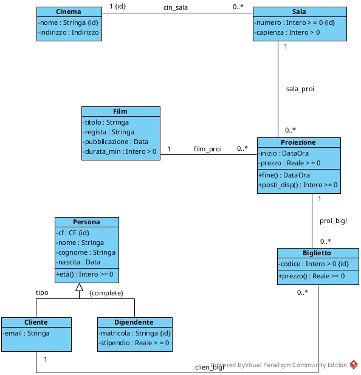

---
title: "CINEMA"
mainfont: "Fira Mono" 
header-includes:
  - \usepackage{float}
  - \floatplacement{figure}{H}
  - \usepackage{titling}
  - \pretitle{\begin{center}\LARGE\bfseries}
  - \posttitle{\end{center}\vspace{-2em}}
  - \preauthor{}
  - \postauthor{}
  - \predate{}
  - \postdate{}
---	


## DIAGRAMMA DELLE CLASSI

	
## SPECIFICA DEI TIPI DI DATO
	
### Indirizzo

```text
(Via: Stringa, Civico: Intero > 0, CAP: [0-9]{5})
```

### CF 

```text
[A-Z]{6}[0-9]{2}[A-Z][0-9]{2}[A-Z][0-9]{3}[A-Z]
```
