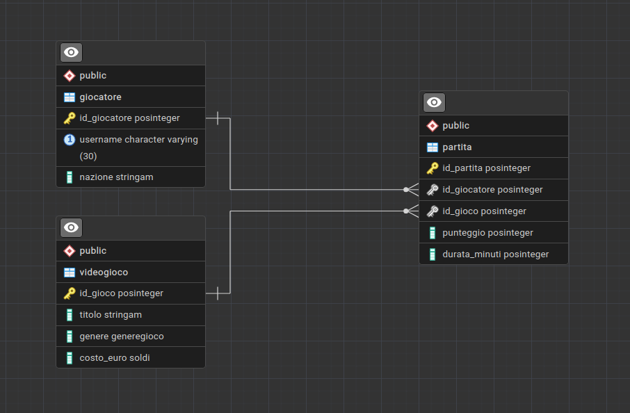

<style>
    /* Cambia il font di tutto il testo normale */
    body {
        font-family: "Fira Mono", monospace;
        font-size: 16px;
    }

    /* Cambia il font dei titoli principali */
    h1, h2 {
        font-family: "Fira Mono", monospace;
    }

    h1 {
        text-align: center;      /* Centra il testo nella pagina */
        font-size: 36px;         /* Lo rende molto grande */
        font-weight: bold;       /* Lo mette in grassetto */
        margin-top: 40px;        /* Aggiunge spazio sopra */
        margin-bottom: 40px;     /* Aggiunge spazio sotto */
    }

    h2 {
        font-size: 22px;
        border-bottom: 1px solid #cccccc;
        font-weight: bold;      
        padding-bottom: 5px;
    }

    h3 {
        font-size: 18px;
        font-weight: bold;
        padding-bottom: 5px;
    }

    /* Cambia il font dentro i blocchi di codice SQL */
    code {
        font-family: "Fira Mono", monospace;
        font-size: 15px;
    }

    /* Rimuove il blu e la sottolineatura dai link dell'indice */
    a {
        color: #333333; /* Grigio scuro elegante invece del blu */
        text-decoration: none; /* Toglie la sottolineatura */
    }
    
    /* Aggiunge un effetto hover se lo guardi a schermo */
    a:hover {
        color: #0056b3;
        text-decoration: underline;
    }
    
    /* Aumenta un po' lo spazio tra le voci dell'indice */
    li {
        margin-bottom: 5px;
    }
</style>


# DATABASE EPICGAMING

- [1 - Schema ER](#1---schema-er)
- [2 - Query SQL](#2---query-sql)

<br><br>

## 1 - Schema ER



<div style="page-break-after: always;"></div>

## 2 - Query SQL

<br><br>

1. Quali sono i videogiochi (restituisci il titolo) che hanno una durata media delle partite strettamente maggiore della durata media di tutte le partite registrate nell'intera piattaforma?
```sql
WITH durataMedia AS (
    SELECT AVG(p.durata_minuti) AS media
    FROM partita p
)
SELECT g.titolo, AVG(p.durata_minuti)
FROM videogioco g, partita p
WHERE g.id_gioco = p.id_gioco
GROUP BY g.id_gioco
HAVING AVG(p.durata_minuti) > (SELECT media FROM durataMedia)
```

<br><br>

2. Per ogni genere di videogioco, calcola il punteggio medio ottenuto nelle partite. Mostra solo i generi in cui il punteggio medio è superiore a 1400, ordinando i risultati dal punteggio medio più alto a quello più basso.
```sql
WITH punteggioMedioGenere AS (
    SELECT g.genere, AVG(p.punteggio) AS media
    FROM videogioco g, partita p
    WHERE g.id_gioco = p.id_gioco 
    GROUP BY g.genere
)
SELECT pmg.genere, pmg.media
FROM punteggioMedioGenere pmg
WHERE pmg.media > 1400
ORDER BY pmg.media DESC
```

<div style="page-break-after: always;"></div>

3. Trova la nazione (o le nazioni) che ha il maggior numero di giocatori distinti che hanno effettuato almeno una partita a un gioco di genere 'RPG'.
```sql
WITH giocatoriRPGNazione AS (
    SELECT g.nazione, COUNT(DISTINCT g.id_giocatore) as num_giocatori
    FROM giocatore g, partita p, videogioco vg
    WHERE vg.id_gioco = p.id_gioco AND
          p.id_giocatore = g.id_giocatore AND
          vg.genere = 'RPG' 
    GROUP BY g.nazione
)
SELECT gRPG.nazione, gRPG.num_giocatori
FROM giocatoriRPGNazione gRPG
WHERE gRPG.num_giocatori = (SELECT MAX(num_giocatori) FROM giocatoriRPGNazione)
```