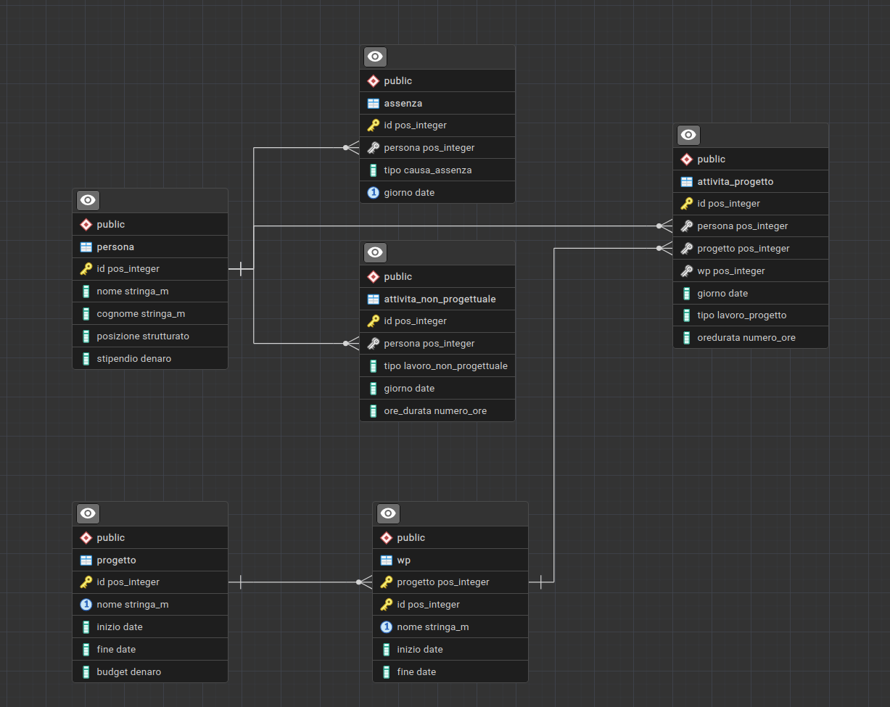

<style>
    /* Cambia il font di tutto il testo normale */
    body {
        font-family: "Fira Mono", monospace;
        font-size: 16px;
    }

    /* Cambia il font dei titoli principali */
    h1, h2 {
        font-family: "Fira Mono", monospace;
    }

    h1 {
        text-align: center;      /* Centra il testo nella pagina */
        font-size: 36px;         /* Lo rende molto grande */
        font-weight: bold;       /* Lo mette in grassetto */
        margin-top: 40px;        /* Aggiunge spazio sopra */
        margin-bottom: 40px;     /* Aggiunge spazio sotto */
    }

    h2 {
        font-size: 22px;
        border-bottom: 1px solid #cccccc;
        font-weight: bold;      
        padding-bottom: 5px;
    }

    /* Cambia il font dentro i blocchi di codice SQL */
    code {
        font-family: "Fira Mono", monospace;
        font-size: 15px;
    }
</style>


# DATABASE ACCADEMIA

## Schema ER


<div style="page-break-after: always;"></div>

## Codice sql
```sql
DROP DATABASE IF EXISTS accademia;

CREATE DATABASE accademia;

\c accademia;

CREATE TYPE strutturato AS enum (
    'Ricercatore', 
    'Professore Associato', 
    'Professore Ordinario'
);

CREATE TYPE lavoro_progetto AS enum (
    'Ricerca e Sviluppo', 
    'Dimostrazione', 
    'Management', 
    'Altro'
);

CREATE TYPE lavoro_non_progettuale as enum (
    'Didattica', 
    'Ricerca', 
    'Missione', 
    'Incontro Dipartimentale', 
    'Incontro Accademico', 
    'Altro'
);

CREATE TYPE causa_assenza AS enum (
    'Chiusura Universitaria', 
    'Maternita', 
    'Malattia'
);

CREATE DOMAIN pos_integer AS INTEGER 
    CHECK (VALUE >= 0);

CREATE DOMAIN stringa_m AS VARCHAR(100);

CREATE DOMAIN numero_ore AS INTEGER
    CHECK (VALUE >= 0 AND VALUE <= 8);

CREATE DOMAIN denaro AS REAL 
    CHECK (VALUE >= 0);


CREATE TABLE persona (
    id pos_integer NOT NULL,
    nome stringa_m NOT NULL,
    cognome stringa_m NOT NULL,
    posizione strutturato NOT NULL,
    stipendio denaro NOT NULL,

    PRIMARY KEY (id)
);

CREATE TABLE progetto (
    id pos_integer NOT NULL,
    nome stringa_m NOT NULL,
    inizio date NOT NULL,
    fine date NOT NULL,
    budget denaro NOT NULL,

    PRIMARY KEY (id),
    UNIQUE (nome),
    CHECK (fine > inizio)
);

CREATE TABLE wp (
    progetto pos_integer NOT NULL,
    id pos_integer NOT NULL,
    nome stringa_m NOT NULL,
    inizio date NOT NULL,
    fine date NOT NULL,

    PRIMARY KEY (progetto, id),
    UNIQUE (progetto, nome),
    FOREIGN KEY (progetto) REFERENCES progetto(id),
    CHECK (fine > inizio)
);

CREATE TABLE attivita_progetto (
    id pos_integer NOT NULL,
    persona pos_integer NOT NULL,
    progetto pos_integer NOT NULL,
    wp pos_integer NOT NULL,
    giorno date NOT NULL,
    tipo lavoro_progetto NOT NULL,
    oreDurata numero_ore NOT NULL,

    PRIMARY KEY (id),
    FOREIGN KEY (persona) REFERENCES persona(id),
    FOREIGN KEY (progetto, wp) REFERENCES wp(progetto, id)
);


CREATE TABLE attivita_non_progettuale (
    id pos_integer NOT NULL,
    persona pos_integer NOT NULL,
    tipo lavoro_non_progettuale NOT NULL,
    giorno date NOT NULL,
    ore_durata numero_ore NOT NULL,

    PRIMARY KEY (id),
    FOREIGN KEY (persona) REFERENCES persona(id)
);

CREATE TABLE assenza (
    id pos_integer NOT NULL,
    persona pos_integer NOT NULL,
    tipo causa_assenza NOT NULL,
    giorno date NOT NULL,

    PRIMARY KEY (id),
    UNIQUE (persona, giorno),
    FOREIGN KEY (persona) REFERENCES persona(id)
);
```