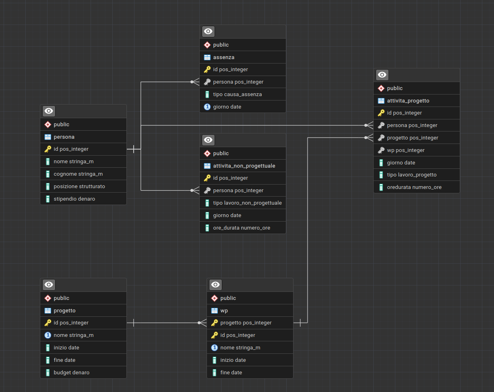

<style>
    /* Cambia il font di tutto il testo normale */
    body {
        font-family: "Fira Mono", monospace;
        font-size: 16px;
    }

    /* Cambia il font dei titoli principali */
    h1, h2 {
        font-family: "Fira Mono", monospace;
    }

    h1 {
        text-align: center;      /* Centra il testo nella pagina */
        font-size: 36px;         /* Lo rende molto grande */
        font-weight: bold;       /* Lo mette in grassetto */
        margin-top: 40px;        /* Aggiunge spazio sopra */
        margin-bottom: 40px;     /* Aggiunge spazio sotto */
    }

    h2 {
        font-size: 22px;
        border-bottom: 1px solid #cccccc;
        font-weight: bold;      
        padding-bottom: 5px;
    }

    h3 {
        font-size: 18px;
        font-weight: bold;
        padding-bottom: 5px;
    }

    /* Cambia il font dentro i blocchi di codice SQL */
    code {
        font-family: "Fira Mono", monospace;
        font-size: 15px;
    }

    /* Rimuove il blu e la sottolineatura dai link dell'indice */
    a {
        color: #333333; /* Grigio scuro elegante invece del blu */
        text-decoration: none; /* Toglie la sottolineatura */
    }
    
    /* Aggiunge un effetto hover se lo guardi a schermo */
    a:hover {
        color: #0056b3;
        text-decoration: underline;
    }
    
    /* Aumenta un po' lo spazio tra le voci dell'indice */
    li {
        margin-bottom: 5px;
    }
</style>


# DATABASE ACCADEMIA

- [1 - Schema ER](#1---schema-er)
- [2 - Codice SQL](#2---codice-sql)
- [3 - Query SQL](#3---query-sql)
  - [3.1 - Query su tabella singola](#31---query-su-tabella-singola)
  - [3.2 - Query su tabelle multiple](#32---query-su-tabelle-multiple)
  - [3.3 - Query con raggruppamenti ed aggregati](#33---query-con-raggruppamenti-ed-aggregati)
  - [3.4 - Query annidate o tabelle temporanee con WITH](#34---query-annidate-o-tabelle-temporanee-con-with)

<br><br>

## 1 - Schema ER


<div style="page-break-after: always;"></div>

## 2 - Codice SQL
```sql
DROP DATABASE IF EXISTS accademia;

CREATE DATABASE accademia;

\c accademia;

CREATE TYPE strutturato AS enum (
    'Ricercatore', 
    'Professore Associato', 
    'Professore Ordinario'
);

CREATE TYPE lavoro_progetto AS enum (
    'Ricerca e Sviluppo', 
    'Dimostrazione', 
    'Management', 
    'Altro'
);

CREATE TYPE lavoro_non_progettuale as enum (
    'Didattica', 
    'Ricerca', 
    'Missione', 
    'Incontro Dipartimentale', 
    'Incontro Accademico', 
    'Altro'
);

CREATE TYPE causa_assenza AS enum (
    'Chiusura Universitaria', 
    'Maternita', 
    'Malattia'
);

CREATE DOMAIN pos_integer AS INTEGER 
    CHECK (VALUE >= 0);

CREATE DOMAIN stringa_m AS VARCHAR(100);

CREATE DOMAIN numero_ore AS INTEGER
    CHECK (VALUE >= 0 AND VALUE <= 8);

CREATE DOMAIN denaro AS REAL 
    CHECK (VALUE >= 0);


CREATE TABLE persona (
    id pos_integer NOT NULL,
    nome stringa_m NOT NULL,
    cognome stringa_m NOT NULL,
    posizione strutturato NOT NULL,
    stipendio denaro NOT NULL,

    PRIMARY KEY (id)
);

CREATE TABLE progetto (
    id pos_integer NOT NULL,
    nome stringa_m NOT NULL,
    inizio date NOT NULL,
    fine date NOT NULL,
    budget denaro NOT NULL,

    PRIMARY KEY (id),
    UNIQUE (nome),
    CHECK (fine > inizio)
);

CREATE TABLE wp (
    progetto pos_integer NOT NULL,
    id pos_integer NOT NULL,
    nome stringa_m NOT NULL,
    inizio date NOT NULL,
    fine date NOT NULL,

    PRIMARY KEY (progetto, id),
    UNIQUE (progetto, nome),
    FOREIGN KEY (progetto) REFERENCES progetto(id),
    CHECK (fine > inizio)
);

CREATE TABLE attivita_progetto (
    id pos_integer NOT NULL,
    persona pos_integer NOT NULL,
    progetto pos_integer NOT NULL,
    wp pos_integer NOT NULL,
    giorno date NOT NULL,
    tipo lavoro_progetto NOT NULL,
    oreDurata numero_ore NOT NULL,

    PRIMARY KEY (id),
    FOREIGN KEY (persona) REFERENCES persona(id),
    FOREIGN KEY (progetto, wp) REFERENCES wp(progetto, id)
);


CREATE TABLE attivita_non_progettuale (
    id pos_integer NOT NULL,
    persona pos_integer NOT NULL,
    tipo lavoro_non_progettuale NOT NULL,
    giorno date NOT NULL,
    ore_durata numero_ore NOT NULL,

    PRIMARY KEY (id),
    FOREIGN KEY (persona) REFERENCES persona(id)
);

CREATE TABLE assenza (
    id pos_integer NOT NULL,
    persona pos_integer NOT NULL,
    tipo causa_assenza NOT NULL,
    giorno date NOT NULL,

    PRIMARY KEY (id),
    UNIQUE (persona, giorno),
    FOREIGN KEY (persona) REFERENCES persona(id)
);
```

<div style="page-break-after: always;"></div>

## 3 - Query SQL

### 3.1 - Query su tabella singola

1. Quali sono i cognomi distinti di tutti gli strutturati?
```sql
SELECT DISTINCT cognome
FROM Persona
```

2. Quali sono i Ricercatori (con nome e cognome)?
```sql
SELECT id, nome, cognome
FROM Persona
WHERE posizione = 'Ricercatore'
```

3. Quali sono i Professori Associati il cui cognome comincia con la lettera ‘V’?
```sql
SELECT id, nome, cognome
FROM Persona
WHERE posizione = 'Professore Associato' AND cognome LIKE 'V%'
```

4. Quali sono i Professori (sia Associati che Ordinari) il cui cognome comincia con la lettera ‘V’?
```sql
SELECT id, nome, cognome
FROM Persona
WHERE (posizione = 'Professore Associato' OR 
       posizione = 'Professore Ordinario') AND cognome LIKE 'V%'
```	

5. Quali sono i Progetti già terminati alla data odierna?
```sql
SELECT *
FROM Progetto
WHERE fine <= CURRENT_DATE
```

<div style="page-break-after: always;"></div>

6. Quali sono i nomi di tutti i Progetti ordinati in ordine crescente di data di inizio?
```sql
SELECT id, nome
FROM Progetto
ORDER BY inizio ASC
```

7. Quali sono i nomi dei WP ordinati in ordine crescente (per nome)?
```sql
SELECT nome
FROM WP
ORDER BY nome asc
```

8. Quali sono (distinte) le cause di assenza di tutti gli strutturati?
```sql
SELECT DISTINCT tipo
FROM Assenza
```

9. Quali sono (distinte) le tipologie di attività di progetto di tutti gli strutturati?
```sql
SELECT DISTINCT tipo
FROM AttivitaProgetto
```
10. Quali sono i giorni distinti nei quali del personale ha effettuato attività non progettuali di tipo ‘Didattica’ ? Dare il risultato in ordine crescente.
```sql
SELECT DISTINCT giorno
FROM AttivitaNonProgettuale
WHERE tipo = 'Didattica'
ORDER BY giorno ASC
```

<div style="page-break-after: always;"></div>

### 3.2 - Query su tabelle multiple

1. Quali sono il nome, la data di inizio e la data di fine dei WP del progetto di nome ‘Pegasus’ ?
```sql
SELECT WP.nome, WP.inizio, WP.fine
FROM WP, Progetto
WHERE Progetto.nome = 'Pegasus' AND ( WP.progetto = Progetto.id )
```

2. Quali sono il nome, il cognome e la posizione degli strutturati che hanno almeno una attività nel progetto ‘Pegasus’, ordinati per cognome decrescente?
```sql
SELECT DISTINCT Persona.nome, Persona.cognome, Persona.posizione
FROM Persona, AttivitaProgetto, Progetto
WHERE (AttivitaProgetto.persona = Persona.id) AND 
      (AttivitaProgetto.progetto = Progetto.id) AND
      (Progetto.nome = 'Pegasus')
ORDER BY Persona.cognome DESC
```

3. Quali sono il nome, il cognome e la posizione degli strutturati che hanno più di una attività nel progetto ‘Pegasus’ ?
```sql
SELECT DISTINCT Persona.nome, Persona.cognome, Persona.posizione
FROM Persona, AttivitaProgetto AS ap1, 
     AttivitaProgetto AS ap2, Progetto
WHERE (ap1.id <> ap2.id) AND (Progetto.nome = 'Pegasus') AND 
      (Progetto.id = ap1.progetto AND Progetto.id = ap2.progetto) AND
      (Persona.id = ap1.persona AND Persona.id = ap2.persona)	
```

4. Quali sono il nome e il cognome dei Professori Ordinari che hanno fatto almeno una assenza per malattia?
```sql
SELECT DISTINCT Persona.nome, Persona.cognome
FROM Persona, Assenza
WHERE Persona.posizione = 'Professore Ordinario' AND
      Assenza.tipo = 'Malattia' AND
      Assenza.persona = Persona.id
```

<div style="page-break-after: always;"></div>

5. Quali sono il nome e il cognome dei Professori Ordinari che hanno fatto più di una assenza per malattia?
```sql
SELECT DISTINCT Persona.nome, Persona.cognome
FROM Persona, Assenza AS ass1, Assenza AS ass2
WHERE ass1.id <> ass2.id AND
      Persona.posizione = 'Professore Ordinario' AND
      (ass1.tipo = 'Malattia' AND ass2.tipo = 'Malattia') AND
      (ass1.persona = Persona.id AND ass2.persona = Persona.id)
```

6. Quali sono il nome e il cognome dei Ricercatori che hanno almeno un impegno per didattica?
```sql
SELECT DISTINCT Persona.nome, Persona.cognome
FROM Persona, AttivitaNonProgettuale AS anp
WHERE Persona.posizione = 'Ricercatore' AND
      anp.tipo = 'Didattica' AND
      anp.persona = Persona.id
```

7. Quali sono il nome e il cognome dei Ricercatori che hanno più di un impegno per didattica?
```sql
SELECT DISTINCT Persona.nome, Persona.cognome
FROM Persona, AttivitaNonProgettuale AS anp1,
     AttivitaNonProgettuale AS anp2
WHERE Persona.posizione = 'Ricercatore' AND
      anp1.id <> anp2.id AND
      anp1.tipo = 'Didattica' AND anp2.tipo = 'Didattica' AND
      anp1.persona = Persona.id AND anp2.persona = Persona.id
```

8. Quali sono il nome e il cognome degli strutturati che nello stesso giorno hanno sia attività progettuali che attività non progettuali?
```sql
SELECT DISTINCT Persona.nome, Persona.cognome
FROM Persona, AttivitaProgetto AS ap, AttivitaNonProgettuale AS anp
WHERE ap.giorno = anp.giorno AND
      persona.id = ap.persona AND
      persona.id = anp.persona
```

<div style="page-break-after: always;"></div>

9. Quali sono il nome e il cognome degli strutturati che nello stesso giorno hanno sia attività progettuali che attività non progettuali? Si richiede anche di proiettare il giorno, il nome del progetto, il tipo di attività non progettuali e la durata in ore di entrambe le attività.
```sql
SELECT DISTINCT Persona.nome, Persona.cognome, ap.giorno,
                Progetto.nome, ap.oreDurata, anp.tipo, anp.oreDurata 
FROM Persona, AttivitaProgetto AS ap, 
     AttivitaNonProgettuale AS anp, Progetto
WHERE ap.giorno = anp.giorno AND
      persona.id = ap.persona AND
      persona.id = anp.persona AND 
      Progetto.id = ap.progetto
```

10. Quali sono il nome e il cognome degli strutturati che nello stesso giorno sono assenti e hanno attività progettuali?
```sql
SELECT DISTINCT Persona.nome, Persona.cognome
FROM Persona, Assenza, AttivitaProgetto AS ap
WHERE Assenza.giorno = ap.giorno AND 
      Assenza.persona = Persona.id AND
      ap.persona = Persona.id
```

11. Quali sono il nome e il cognome degli strutturati che nello stesso giorno sono assenti e hanno attività progettuali? Si richiede anche di proiettare il giorno, il nome del progetto, la causa di assenza e la durata in ore della attività progettuale.
```sql
SELECT Persona.nome, Persona.cognome, 
       Assenza.giorno, Assenza.tipo, 
       Progetto.nome, ap.oreDurata
FROM Persona, Assenza, AttivitaProgetto AS ap, Progetto
WHERE Assenza.giorno = ap.giorno AND
      Assenza.persona = Persona.id AND
      ap.persona = Persona.id AND
      ap.progetto = Progetto.id
```	

<div style="page-break-after: always;"></div>

12. Quali sono i WP che hanno lo stesso nome, ma appartengono a progetti diversi?
```sql
SELECT DISTINCT wp1.nome 
FROM WP AS wp1, WP AS wp2
WHERE wp1.nome = wp2.nome AND
      wp1.progetto <> wp2.progetto
```

<div style="page-break-after: always;"></div>

### 3.3 - Query con raggruppamenti ed aggregati

1. Quanti sono gli strutturati di ogni fascia?
```sql
SELECT posizione, COUNT(*) AS numero
FROM persona
GROUP BY posizione
```

2. Quanti sono gli strutturati con stipendio ≥ 40000?
```sql
SELECT COUNT(*) AS numero
FROM persona
WHERE stipendio >= 40000
```

3. Quanti sono i progetti già finiti che superano il budget di 50000?
```sql
SELECT COUNT(*) AS numero
FROM progetto
WHERE budget > 50000 AND
      fine < CURRENT_DATE
```

4. Qual è la media, il massimo e il minimo delle ore delle attività relative al progetto ‘Pegasus’?
```sql
SELECT AVG(ap.oreDurata) AS media, MIN(ap.oreDurata) AS minimo,
       MAX(ap.oreDurata) AS massimo
FROM attivitaprogetto AS ap, progetto AS p
WHERE p.nome = 'Pegasus' AND
      ap.progetto = p.id 
```

<div style="page-break-after: always;"></div>

5. Quali sono le medie, i massimi e i minimi delle ore giornaliere dedicate al progetto
‘Pegasus’ da ogni singolo docente?
```sql
SELECT persona.id, persona.nome, persona.cognome,
       AVG(ap.oreDurata) AS media, MIN(ap.oreDurata) AS minimo,
       MAX(ap.oreDurata) AS massimo
FROM attivitaprogetto AS ap, progetto AS p,
     persona
WHERE p.nome = 'Pegasus' AND
      ap.progetto = p.id AND
      ap.persona = persona.id
GROUP BY persona.id, persona.nome, persona.cognome
```

6. Qual è il numero totale di ore dedicate alla didattica da ogni docente?
```sql
SELECT p.id, p.nome, p.cognome,
       SUM(anp.oreDurata)
FROM persona as p, attivitanonprogettuale as anp
WHERE anp.persona = p.id AND
      anp.tipo = 'Didattica'
GROUP BY p.id, p.nome, p.cognome
```

7. Qual è la media, il massimo e il minimo degli stipendi dei ricercatori?
```sql
SELECT AVG(p.stipendio) AS media, MIN(p.stipendio) AS minimo,
       MAX(p.stipendio) AS massimo
FROM persona AS p
WHERE p.posizione = 'Ricercatore'
```

8. Quali sono le medie, i massimi e i minimi degli stipendi dei ricercatori, dei professori associati e dei professori ordinari?
```sql
SELECT posizione, AVG(p.stipendio) AS media, 
       MIN(p.stipendio) AS minimo, MAX(p.stipendio) AS massimo
FROM persona as p
WHERE p.posizione = 'Ricercatore' OR
      p.posizione = 'Professore Associato' OR
      p.posizione = 'Professore Ordinario'
GROUP BY posizione
```

9. Quante ore ‘Ginevra Riva’ ha dedicato ad ogni progetto nel quale ha lavorato?
```sql
SELECT prog.nome, SUM(ap.oreDurata)
FROM persona AS p, attivitaprogetto AS ap, progetto AS prog
WHERE p.nome = 'Ginevra' AND p.cognome = 'Riva' AND
      p.id = ap.persona AND prog.id = ap.progetto
GROUP BY prog.nome
```

10. Qual è il nome dei progetti su cui lavorano più di due strutturati?
```sql
SELECT prog.nome
FROM progetto AS prog, attivitaprogetto AS ap
WHERE prog.id = ap.progetto
GROUP BY prog.nome 
HAVING COUNT(DISTINCT ap.persona) > 2
```

11. Quali sono i professori associati che hanno lavorato su più di un progetto?
```sql
SELECT p.id, p.nome, p.cognome
FROM persona AS p, attivitaprogetto AS ap
WHERE p.id = ap.persona AND
      p.posizione = 'Professore Associato'
GROUP BY p.id, p.nome, p.cognome
HAVING COUNT(DISTINCT ap.progetto) > 1
```

<div style="page-break-after: always;"></div>

### 3.4 - Query annidate o tabelle temporanee con WITH

1. Qual è media e deviazione standard degli stipendi per ogni categoria di strutturati?
```sql
SELECT p.posizione, AVG(p.stipendio),
       STDDEV_SAMP(p.stipendio)
FROM persona p
GROUP BY p.posizione
```

2. Quali sono i ricercatori (tutti gli attributi) con uno stipendio superiore alla media
della loro categoria?
```sql
WITH mediaStipendio AS (
    SELECT AVG(p.stipendio) AS media
    FROM persona p
    WHERE p.posizione = 'Ricercatore'
)
SELECT *
FROM persona p, mediaStipendio m
WHERE p.posizione = 'Ricercatore' AND
      p.stipendio > m.media
```

3. Per ogni categoria di strutturati quante sono le persone con uno stipendio che
differisce di al massimo una deviazione standard dalla media della loro categoria?
```sql
WITH devMedia AS (
    SELECT p.posizione, STDDEV_SAMP(p.stipendio) AS dev, AVG(p.stipendio) AS media
    FROM persona p
    GROUP BY p.posizione
)
SELECT p.posizione, COUNT(*)
FROM persona p, devMedia dm
WHERE p.posizione = dm.posizione AND 
      ABS(p.stipendio - dm.media) <= dm.dev 
GROUP BY p.posizione
```

<div style="page-break-after: always;"></div>

4. Chi sono gli strutturati che hanno lavorato almeno 20 ore complessive in attività
progettuali? Restituire tutti i loro dati e il numero di ore lavorate.
```sql
WITH totOre AS (
    SELECT p.id, SUM(ap.oreDurata) AS tot
    FROM persona p, attivitaprogetto ap
    WHERE p.id = ap.persona 
    GROUP BY p.id
)
SELECT p.*, totOre.tot
FROM persona p, totOre
WHERE p.id = totOre.id AND
      totOre.tot >= 20
```

5. Quali sono i progetti la cui durata è superiore alla media delle durate di tutti i
progetti? Restituire nome dei progetti e loro durata in giorni.
```sql
WITH mediaDurata AS (
    SELECT AVG(p.fine - p.inizio) AS media
    FROM progetto p
)
SELECT p.nome, (p.fine - p.inizio) AS durata
FROM progetto p, mediaDurata md
WHERE (p.fine - p.inizio) > md.media
```

6. Quali sono i progetti terminati in data odierna che hanno avuto attività di tipo
“Dimostrazione”? Restituire nome di ogni progetto e il numero complessivo delle
ore dedicate a tali attività nel progetto.
```sql
WITH progDimostrazione AS (
    SELECT progetto, SUM(oreDurata) AS totOre
    FROM attivitaprogetto
    WHERE tipo = 'Dimostrazione'
    GROUP BY progetto
)
SELECT prog.nome, pd.totOre
FROM progetto prog, progDimostrazione pd
WHERE prog.id = pd.progetto AND
      prog.fine <= CURRENT_DATE
```

7. Quali sono i professori ordinari che hanno fatto più assenze per malattia del numero di assenze medio per malattia dei professori associati? Restituire id, nome e
cognome del professore e il numero di giorni di assenza per malattia.
```sql
WITH assenzeAssociati AS (
    SELECT p.id, COUNT(a.id) AS num_assenze
    FROM assenza a, persona p
    WHERE p.id = a.persona AND
          p.posizione = 'Professore Associato' AND
          a.tipo = 'Malattia'
    GROUP BY p.id
), mediaAssenzeAssociati AS (
    SELECT AVG(num_assenze) AS media
    FROM assenzeAssociati
)
SELECT p.id, p.nome, p.cognome, COUNT(a.id)
FROM persona p, assenza a, mediaAssenzeAssociati ma
WHERE p.id = a.persona AND
      p.posizione = 'Professore Ordinario' AND
      a.tipo = 'Malattia'
GROUP BY p.id, p.nome, p.cognome, ma.media  
HAVING COUNT(a.id) > ma.media
```