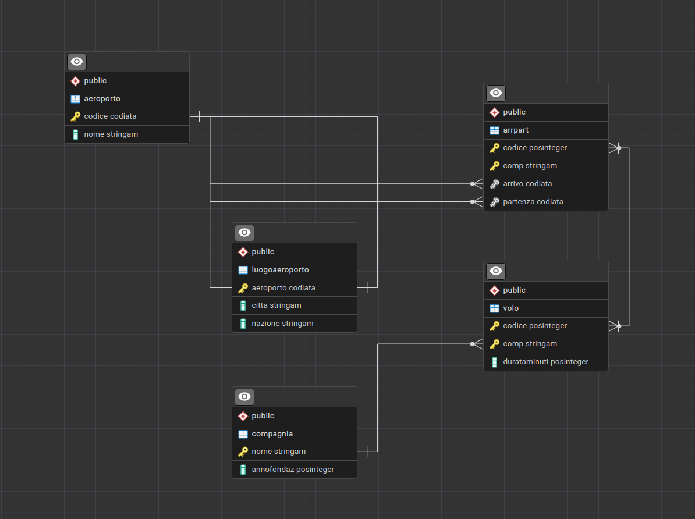

<style>
    /* Cambia il font di tutto il testo normale */
    body {
        font-family: "Fira Mono", monospace;
        font-size: 16px;
    }

    /* Cambia il font dei titoli principali */
    h1, h2 {
        font-family: "Fira Mono", monospace;
    }

    h1 {
        text-align: center;      /* Centra il testo nella pagina */
        font-size: 36px;         /* Lo rende molto grande */
        font-weight: bold;       /* Lo mette in grassetto */
        margin-top: 40px;        /* Aggiunge spazio sopra */
        margin-bottom: 40px;     /* Aggiunge spazio sotto */
    }

    h2 {
        font-size: 22px;
        border-bottom: 1px solid #cccccc;
        font-weight: bold;      
        padding-bottom: 5px;
    }

    h3 {
        font-size: 18px;
        font-weight: bold;
        padding-bottom: 5px;
    }

    /* Cambia il font dentro i blocchi di codice SQL */
    code {
        font-family: "Fira Mono", monospace;
        font-size: 15px;
    }
</style>


# DATABASE CIELO

## Schema ER


<div style="page-break-after: always;"></div>

## Query SQL

1. Quali sono i voli (codice e nome della compagnia) la cui durata supera le 3 ore?
```sql
SELECT volo.codice, comp.nome
FROM volo, compagnia AS comp
WHERE volo.comp = comp.nome AND
      volo.durataminuti > 180
```

2. Quali sono le compagnie che hanno voli che superano le 3 ore?
```sql
SELECT DISTINCT comp.nome
FROM compagnia AS comp, volo
WHERE comp.nome = volo.comp AND
      volo.durataminuti > 180
```

3. Quali sono i voli (codice e nome della compagnia) che partono dall’aeroporto con codice ‘CIA’ ?
```sql
SELECT volo.codice, volo.comp
FROM volo, arrpart
WHERE volo.codice = arrpart.codice AND
      volo.comp = arrpart.comp AND
      arrpart.partenza = 'CIA'
```

4. Quali sono le compagnie che hanno voli che arrivano all’aeroporto con codice ‘FCO’ ?
```sql
SELECT DISTINCT volo.comp
FROM volo, arrpart
WHERE volo.codice = arrpart.codice AND
      volo.comp = arrpart.comp AND
      arrpart.arrivo = 'FCO'
```

<div style="page-break-after: always;"></div>

5. Quali sono i voli (codice e nome della compagnia) che partono dall’aeroporto ‘FCO’ e arrivano all’aeroporto ‘JFK’ ?
```sql
SELECT volo.codice, volo.comp
FROM volo, arrpart
WHERE volo.codice = arrpart.codice AND
      volo.comp = arrpart.comp AND
      arrpart.partenza = 'FCO' AND
      arrpart.arrivo = 'JFK'
```

6. Quali sono le compagnie che hanno voli che partono dall’aeroporto ‘FCO’ e atterrano all’aeroporto ‘JFK’ ?
```sql
SELECT DISTINCT volo.comp
FROM volo, arrpart
WHERE volo.codice = arrpart.codice AND
      volo.comp = arrpart.comp AND
      arrpart.partenza = 'FCO' AND
      arrpart.arrivo = 'JFK'
```

7. Quali sono i nomi delle compagnie che hanno voli diretti dalla città di ‘Roma’ alla città di ‘New York’ ?
```sql
SELECT DISTINCT volo.comp
FROM volo, arrpart, luogoaeroporto AS luogoarr, luogoaeroporto AS luogopart
WHERE volo.codice = arrpart.codice AND
      volo.comp = arrpart.comp AND
      luogopart.aeroporto = arrpart.partenza AND
      luogopart.citta = 'Roma' AND
      luogoarr.aeroporto = arrpart.arrivo AND
      luogoarr.citta = 'New York'
```

8. Quali sono gli aeroporti (con codice IATA, nome e luogo) nei quali partono voli
della compagnia di nome ‘MagicFly’ ?
```sql
SELECT DISTINCT a.codice, a.nome, la.citta
FROM aeroporto AS a, luogoaeroporto AS la, arrpart
WHERE arrpart.partenza = a.codice AND
      arrpart.comp = 'MagicFly' AND
      la.aeroporto = a.codice
```

9. Quali sono i voli che partono da un qualunque aeroporto della città di ‘Roma’ e
atterrano ad un qualunque aeroporto della città di ‘New York’ ? Restituire: codice
del volo, nome della compagnia, e aeroporti di partenza e arrivo.
```sql
SELECT volo.codice, volo.comp, arrpart.partenza, arrpart.arrivo
FROM volo, arrpart, luogoaeroporto AS partenza, luogoaeroporto AS arrivo
WHERE volo.codice = arrpart.codice AND
      volo.comp = arrpart.comp AND
      arrpart.partenza = partenza.aeroporto AND
      partenza.citta = 'Roma' AND
      arrpart.arrivo = arrivo.aeroporto AND
      arrivo.citta = 'New York'
```

10. Quali sono i possibili piani di volo con esattamente un cambio (utilizzando solo
voli della stessa compagnia) da un qualunque aeroporto della città di ‘Roma’ ad un
qualunque aeroporto della città di ‘New York’ ? Restituire: nome della compagnia,
codici dei voli, e aeroporti di partenza, scalo e arrivo.
```sql
SELECT volo1.comp, volo1.codice, volo2.codice, 
       arrpart1.partenza, arrpart1.arrivo, arrpart2.arrivo
FROM volo AS volo1, volo AS volo2, 
     arrpart AS arrpart1, arrpart AS arrpart2,
     luogoaeroporto AS partenza, luogoaeroporto AS scalo,
     luogoaeroporto AS arrivo
WHERE volo1.comp = volo2.comp AND
      volo1.codice = arrpart1.codice AND
      volo1.comp = arrpart1.comp AND
      arrpart1.partenza = partenza.aeroporto AND
      partenza.citta = 'Roma' AND
      arrpart1.arrivo = scalo.aeroporto AND
      scalo.citta <> 'New York' AND
      volo2.codice = arrpart2.codice AND
      volo2.comp = arrpart2.comp AND
      arrpart1.arrivo = arrpart2.partenza AND
      arrpart2.arrivo = arrivo.aeroporto AND
      arrivo.citta = 'New York'
```

<div style="page-break-after: always;"></div>

11. Quali sono le compagnie che hanno voli che partono dall’aeroporto ‘FCO’, atterrano all’aeroporto ‘JFK’, e di cui si conosce l’anno di fondazione?
```sql
SELECT DISTINCT arrpart.comp
FROM arrpart, compagnia
WHERE arrpart.comp = compagnia.nome AND
      arrpart.partenza = 'FCO' AND
      arrpart.arrivo = 'JFK' AND
      compagnia.annofondaz IS NOT NULL
```
