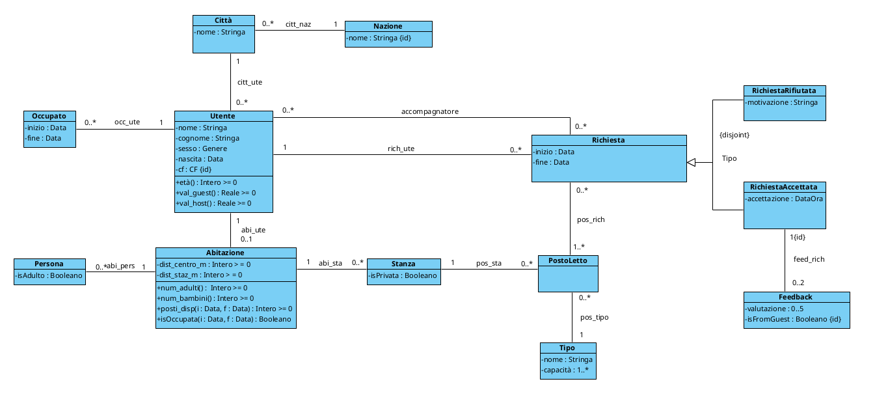
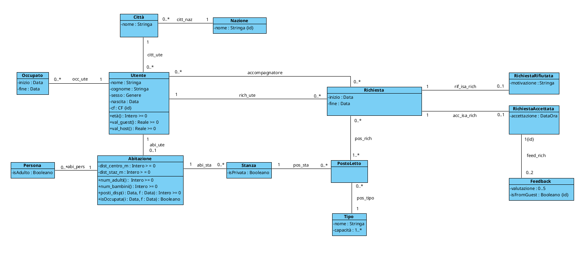
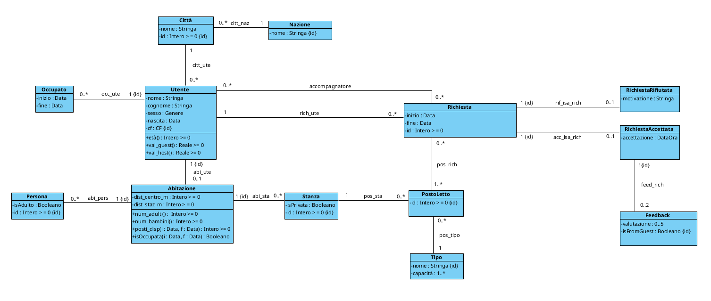

# PROGETTAZIONE DORMO DA TE

- [Diagramma UML di Partenza](#diagramma-uml-di-partenza)
- [FASE 1 - ELIMINAZIONE ATTRIBUTI MULTIVALORE](#fase-1---eliminazione-attributi-multivalore)
- [FASE 2 - SCELTA E PROGETTAZIONE DEI TIPI DI DATO](#fase-2---scelta-e-progettazione-dei-tipi-di-dato)
- [FASE 3 - RISTRUTTURAZIONE DELLE GENERALIZZAZIONI](#fase-3---ristrutturazione-delle-generalizzazioni)
  - [Generalizzazione Richiesta](#generalizzazione-richiesta)
  - [Aggiornamento 1](#aggiornamento-1)
- [FASE 4 - IDENTIFICATORI PER OGNI CLASSE](#fase-4---identificatori-per-ogni-classe)
  - [Aggiornamento 2](#aggiornamento-2)
- [FASE 5 - RISTRUTTURAZIONE VINCOLI ESTERNI ED OPERAZIONI/USE-CASE](#fase-5---ristrutturazione-vincoli-esterni-ed-operazioniuse-case)
- [FASE 6 - TRADUZIONE DEL DIAGRAMMA RISTRUTTURATO IN TABELLE SQL](#fase-6---traduzione-del-diagramma-ristrutturato-in-tabelle-sql)
- [FASE 7 - POLITICHE DI ACCESSO E TRIGGER](#fase-7---politiche-di-accesso-e-trigger)
  - [Politiche di accesso](#politiche-di-accesso)
  - [Trigger](#trigger)

<br><br>

## Diagramma UML di Partenza


<div style="page-break-after: always;"></div>

## FASE 1 - ELIMINAZIONE ATTRIBUTI MULTIVALORE
In fase di analisi non sono stati inseriti attributi multivalore, di conseguenza questa
fase non cambia in nessun modo il nostro diagramma.

## FASE 2 - SCELTA E PROGETTAZIONE DEI TIPI DI DATO
Andiamo ora a scegliere e creare i nostri tipi di dato SQL.

```sql
CREATE DOMAIN Stringa AS varchar;
CREATE DOMAIN Data AS date;
CREATE DOMAIN DataOra AS timestamp;
CREATE DOMAIN Booleano AS boolean;
CREATE TYPE Genere AS ENUM ( 'M', 'F', 'Altro' );

CREATE DOMAIN CF AS varchar(16) 
    CHECK (VALUE ~ '^[A-Z]{6}[0-9]{2}[A-Z][0-9]{2}[A-Z][0-9]{3}[A-Z]$')

CREATE DOMAIN "Intero > 0" AS int
    CHECK (VALUE > 0)

CREATE DOMAIN "Intero >= 0" AS int
    CHECK (VALUE >= 0)

CREATE DOMAIN "Reale >= 0" AS real
    CHECK (VALUE >= 0)

CREATE DOMAIN "1..*" AS int
    CHECK (VALUE >= 1)

CREATE DOMAIN "0..5" AS int
    CHECK (VALUE BETWEEN 0 AND 5)
```

<div style="page-break-after: always;"></div>

## FASE 3 - RISTRUTTURAZIONE DELLE GENERALIZZAZIONI
Scegliamo ora come modificare il diagramma UML per trasformarlo in un diagramma equivalente ma senza generalizzazioni

<br>

### Generalizzazione Richiesta
Per questa generalizzazione abbiamo optato per il metodo della sostituzione:
<br>
-PRO: motivazione o accettazione verranno memorizzati unicamente quando servono, evitando valori NULL nella tabella Richiesta
<br>
-CONTRO: costo maggiore per le interrogazioni del database

<br>

### Aggiornamento 1



<div style="page-break-after: always;"></div>

## FASE 4 - IDENTIFICATORI PER OGNI CLASSE
Ora dobbiamo inserire un identificatore per ogni classe 

<br>

### Aggiornamento 2



<br><br>

## FASE 5 - RISTRUTTURAZIONE VINCOLI ESTERNI ED OPERAZIONI/USE-CASE
Dato che nella Fase 3 abbiamo usato il metodo della sostituzione della generalizzazione tramite associazioni, dobbiamo vincolare che una richiesta non sia contemporaneamente accettata e rifiutata:
<br>
```
[V.Richiesta.no_contemporaneamente_accettata_e_rifiutata]
    !EXISTS r, rAcc, rRif |
        Richiesta(r) AND
        RichiestaAccettata(rAcc) AND
        RichiestaRifiutata(rRif) AND
        rif_isa_rich(rRif, r) AND
        acc_isa_rich(rAcc, r)
```

<div style="page-break-after: always;"></div>

## FASE 6 - TRADUZIONE DEL DIAGRAMMA RISTRUTTURATO IN TABELLE SQL

```
Nazione(_nome_:Stringa)

Città(_id_città_:serial, nome:Stringa, nazione:Stringa)
    FOREIGN KEY: nazione REFERENCES Nazione(nome)

Utente(_cf_:CF, nome:Stringa, cognome:Stringa, sesso:Genere, nascita:Data, città:Intero>=0)
    FOREIGN KEY: città REFERENCES Città(id_città)

occ_ute(_utente_:CF, _inizio_:Data, _fine_:Data)
    FOREIGN KEY: utente REFERENCES Utente(cf)

Abitazione(_utente_:CF, dist_centro_m:Intero>=0, dist_staz_m:Intero>=0)
    FOREIGN KEY: utente REFERENCES Utente(cf)

abi_pers(_utente_:CF, _id_persona_:serial, isAdulto:Booleano)
    FOREIGN KEY: utente REFERENCES Abitazione(utente)

Stanza(_utente_:CF, _id_stanza_:serial, isPrivata:Booleano)
    FOREIGN KEY: utente REFERENCES Abitazione(Utente)

Tipo(_nome_:Stringa, capacità:1..*)

PostoLetto(_utente_:CF, _stanza_:Intero>=0, _id_stanza_:serial, tipo:Stringa)
    FOREIGN KEY: (utente, stanza) REFERENCES Stanza(utente, id_stanza)
    FOREIGN KEY: tipo REFERENCES Tipo(nome)

Richiesta(_utente_:CF, _id_richiesta_:serial, inizio:Data, fine:Data)
    FOREIGN KEY: utente REFERENCES Utente(cf)

pos_rich(_prenotatore_:CF, _id_richiesta_:Intero>=0, _proprietario_casa_:CF                 
         _id_stanza_:Intero>=0, _id_posto_:Intero>=0)
    FOREIGN KEY: (prenotatore, id_richiesta) REFERENCES Richiesta(prenotatore, id_richiesta)
    FOREIGN KEY: (proprietario_casa, id_stanza, id_posto) REFERENCES 
    PostoLetto(utenteid_stanza, id_posto)

Accompagnatore(_utente_:CF, _prenotatore_:CF, _id_richiesta_:Intero>=0)
    FOREIGN KEY: (prenotatore, id_richiesta) REFERENCES Richiesta(utente, id_richiesta)
    FOREIGN KEY: utente REFERENCES Utente(cf)
```

<div style="page-break-after: always;"></div>

```
RichiestaRifiutata(_prenotatore_:CF, _id_richiesta_:Intero>=0, motivazione:Stringa)
    FOREIGN KEY: (prenotatore, id_richiesta) REFERENCES Richiesta(utente, id_richiesta)

RichiestaAccettata(_prenotatore_:CF, _id_richiesta_:Intero>=0, accettazione:DataOra)
    FOREIGN KEY: (prenotatore, id_richiesta) REFERENCES Richiesta(utente, id_richiesta)

FeedBack(_prenotatore_:CF, _id_richiesta_:Intero>=0, valutazione:0..5, _isFromGuest_:Booleano)
    FOREIGN KEY: (prenotatore, id_richiesta) REFERENCES 
    RichiestaAccettata(prenotatore, id_richiesta)    
```

<br><br>

## FASE 7 - POLITICHE DI ACCESSO E TRIGGER 

### Politiche di accesso
Evitiamo che si possano modificare gli id artificiali

```sql
Qui vanno inseriti tutti i REVOKE sugli id artificiali
```

<div style="page-break-after: always;"></div>

### Trigger

#### 1. [T.Richiesta.no_senza_feedback_richiesta_precedente]
```sql
CREATE TRIGGER Check_Feedback_Pendenti
BEFORE INSERT ON Richiesta
FOR EACH ROW
BEGIN
    -- Seleziona il numero di viaggi passati senza recensione per questo utente
    DECLARE viaggi_non_recensiti INTERO;

    SET viaggi_non_recensiti = (
        SELECT COUNT(*)
        FROM Richiesta R
        JOIN RichiestaAccettata RA 
          ON R.prenotatore = RA.prenotatore AND R.id_richiesta = RA.id_richiesta
        WHERE R.prenotatore = NEW.prenotatore
          AND R.fine <= CURRENT_DATE  -- Il viaggio deve essere terminato
          AND NOT EXISTS (
              -- Cerca se esiste un feedback come guest per questa specifica richiesta
              SELECT *
              FROM FeedBack F
              WHERE F.prenotatore = R.prenotatore 
                AND F.id_richiesta = R.id_richiesta
                AND F._isFromGuest_ = TRUE
          )
    );

    -- Se c'è almeno un viaggio senza recensione, blocca l'inserimento
    IF viaggi_non_recensiti > 0 THEN
        RAISE EXCEPTION 'Impossibile prenotare: devi prima rilasciare il feedback per i     soggiorni passati.';
    END IF;
END;
```

<div style="page-break-after: always;"></div>

#### 2. [T.Richiesta.no_contemporaneamente_accettata_e_rifiutata]
```sql
CREATE TRIGGER Check_Esclusiva_Accettata
BEFORE INSERT ON RichiestaAccettata
FOR EACH ROW
BEGIN
    -- Controlla se la stessa richiesta esiste già tra quelle rifiutate
    IF EXISTS (
        SELECT * 
        FROM RichiestaRifiutata RR
        WHERE RR.prenotatore = NEW.prenotatore
          AND RR.id_richiesta = NEW.id_richiesta
    ) THEN
        RAISE EXCEPTION 'Errore: Questa richiesta è già stata registrata come RIFIUTATA.';
    END IF;
END;
```

#### 3. Controllo auto-prenotazione
```sql
ALTER TABLE pos_rich
ADD CONSTRAINT No_Auto_Prenotazione
    CHECK (prenotatore <> proprietario_casa);
```

#### 4. Controllo no inizio prima della fine tabelle Richiesta ed occ_ute
```sql
ALTER TABLE Richiesta
ADD CONSTRAINT Date_Valide
    CHECK (inizio < fine);

ALTER TABLE Occupato
ADD CONSTRAINT Date_valide
    CHECK (inizio < fine);
```