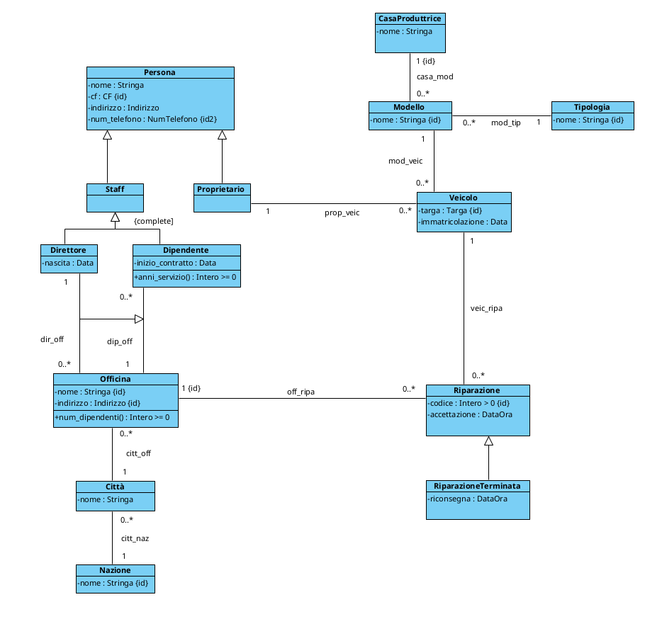
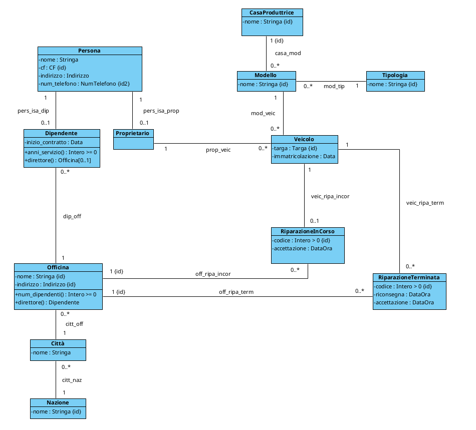

<style>
    /* Cambia il font di tutto il testo normale */
    body {
        font-family: "Fira Mono", monospace;
        font-size: 16px;
    }

    /* Cambia il font dei titoli principali */
    h1, h2 {
        font-family: "Fira Mono", monospace;
    }

    h1 {
        text-align: center;      /* Centra il testo nella pagina */
        font-size: 36px;         /* Lo rende molto grande */
        font-weight: bold;       /* Lo mette in grassetto */
        margin-top: 40px;        /* Aggiunge spazio sopra */
        margin-bottom: 40px;     /* Aggiunge spazio sotto */
    }

    h2 {
        font-size: 22px;
        border-bottom: 1px solid #cccccc;
        font-weight: bold;      
        padding-bottom: 5px;
        margin-top: 50px;
    }

    h3 {
        font-size: 18px;
        font-weight: bold;
        padding-bottom: 5px;
    }

    h4 {
        font-size: 14px;
        font-weight: bold;
    }

    /* Cambia il font dentro i blocchi di codice SQL */
    code {
        font-family: "Fira Mono", monospace;
        font-size: 15px;
    }
</style>


# PROGETTAZIONE OFFICINE

## Diagramma UML di partenza


## FASE 1 - ELIMINAZIONE ATTRIBUTI MULTIVALORE
In fase di analisi non sono stati inseriti attributi multivalore, di conseguenza questa
fase non cambia in nessun modo il nostro diagramma.

## FASE 2 - SCELTA E PROGETTAZIONE DEI TIPI DI DATO
Andiamo ora a scegliere e creare i nostri tipi di dato SQL.

```sql
CREATE DOMAIN Stringa AS varchar;
CREATE DOMAIN Data AS date;
CREATE DOMAIN DataOra AS timestamp;

CREATE DOMAIN CF AS varchar(16) 
    CHECK (VALUE ~ '^[A-Z]{6}[0-9]{2}[A-Z][0-9]{2}[A-Z][0-9]{3}[A-Z]$')


CREATE TYPE __Indirizzo__ AS (
    Via: varchar(100),
    Civico: int,
    CAP: varchar(5)
)

CREATE DOMAIN Indirizzo AS __Indirizzo__ 
    CHECK (
        (VALUE).Via IS NOT NULL AND
        (VALUE).Civico IS NOT NULL AND
        (VALUE).CAP ~ '^[0-9]{5}$'
    )


CREATE DOMAIN NumTelefono AS varchar(10) 
    CHECK (VALUE ~ '^[0-9]{10}$')

CREATE DOMAIN Targa AS varchar(7)
    CHECK (VALUE ~ '^[A-Z]{2}[0-9]{3}[A-Z]{2}$')

CREATE DOMAIN "Intero > 0" AS int
    CHECK (VALUE > 0)

CREATE DOMAIN "Intero >= 0" AS int
    CHECK (VALUE >= 0)
```

## FASE 3 - RISTRUTTURAZIONE DELLE GENERALIZZAZIONI
Scegliamo ora come modificare il diagramma UML per trasformarlo in un diagramma equivalente ma senza generalizzazioni

### Generalizzazioni Proprietario e Staff
Per queste due generalizzazioni abbiamo optato per il metodo della sostituzione.
#### -PRO: 
Facilità nel cercare un Cliente (Proprietario) o un membro dello Staff

#### -CONTRO:
Se si vincola la possibilità di una Persona di avere entrambi i link (disjoint), se un dipendente volesse portare a riparare il suo veicolo allora le sue informazioni sarabbero salvate due volte (una per Proprietario, un'altra per Staff)

### Generalizzazioni Direttore, Dipendente e link dir_off
In questo caso abbiamo deciso di accorpare le due classi in una sola, "Dipendente", e di usare il metodo della fusione
#### -PRO: 
Aggiungendo un'operazione alla classe Dipendente, siamo in grado di sapere se il nostro dipendente è anche un direttore e, in caso, di quale officina è direttore

#### -CONTRO:
Molte ennuple della tabella Dipendente avranno NULL come valore sulla colonna "officina", ovvero il riferimento all'officina di cui quel dipendente è direttore (perché in proporzione i direttori sono pochi)

### Generalizzazione RiparazioneTerminata
Per questa generalizzazione abbiamo optato per creare due classi, "RiparazioneInCorso" e "RiparazioneTerminata" applicando il metodo della divisione
#### -PRO: 
La navigazione tra riparazioni in corso è semplificata

#### -CONTRO:
Verranno create due tabelle con le informazioni sulle riparazioni, in più, l'aggiornamento dello stato di una riparazione (eliminarla dalla tabella inCorso ed aggiungerla alla tabella Terminate) ha un suo costo
<div style="page-break-after: always;"></div>

### DIAGRAMMA AGGIORNATO


## FASE 4 - IDENTIFICATORI PER OGNI CLASSE

## FASE 5 - RISTRUTTURAZIONE VINCOLI ESTERNI