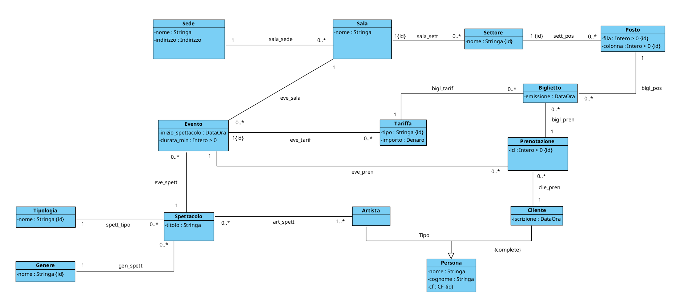
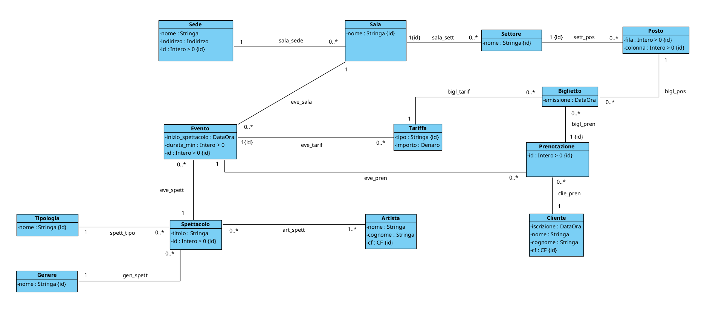

# PROGETTAZIONE OUT!

- [Diagramma UML di partenza](#diagramma-uml-di-partenza)
- [FASE 1 - ELIMINAZIONE ATTRIBUTI MULTIVALORE](#fase-1---eliminazione-attributi-multivalore)
- [FASE 2 - SCELTA E PROGETTAZIONE DEI TIPI DI DATO](#fase-2---scelta-e-progettazione-dei-tipi-di-dato)
- [FASE 3 - RISTRUTTURAZIONE DELLE GENERALIZZAZIONI](#fase-3---ristrutturazione-delle-generalizzazioni)
  - [Generalizzazione Persona](#generalizzazione-persona)
  - [Aggiornamento 1](#aggiornamento-1)
- [FASE 4 - IDENTIFICATORI PER OGNI CLASSE](#fase-4---identificatori-per-ogni-classe)
  - [Aggiornamento 2](#aggiornamento-2)
- [FASE 5 - RISTRUTTURAZIONE VINCOLI ESTERNI ED OPERAZIONI/USE-CASE](#fase-5---ristrutturazione-vincoli-esterni-ed-operazioniuse-case)
- [FASE 6 - TRADUZIONE DEL DIAGRAMMA RISTRUTTURATO IN TABELLE SQL](#fase-6---traduzione-del-diagramma-ristrutturato-in-tabelle-sql)
- [FASE 7 - POLITICHE DI ACCESSO E TRIGGER](#fase-7---politiche-di-accesso-e-trigger)
  - [Politiche di accesso](#politiche-di-accesso)
  - [Trigger](#trigger)

<br><br>

## Diagramma UML di partenza


<div style="page-break-after: always;"></div>

## FASE 1 - ELIMINAZIONE ATTRIBUTI MULTIVALORE
In fase di analisi non sono stati inseriti attributi multivalore, di conseguenza questa
fase non cambia in nessun modo il nostro diagramma.

## FASE 2 - SCELTA E PROGETTAZIONE DEI TIPI DI DATO
Andiamo ora a scegliere e creare i nostri tipi di dato SQL.

```sql
CREATE DOMAIN Stringa AS varchar;
CREATE DOMAIN Data AS date;
CREATE DOMAIN DataOra AS timestamp;

CREATE DOMAIN CF AS varchar(16) 
    CHECK (VALUE ~ '^[A-Z]{6}[0-9]{2}[A-Z][0-9]{2}[A-Z][0-9]{3}[A-Z]$')

CREATE TYPE __Indirizzo__ AS (
    Via: varchar(100),
    Civico: int,
    CAP: varchar(5)
)

CREATE DOMAIN Indirizzo AS __Indirizzo__ 
    CHECK (
        (VALUE).Via IS NOT NULL AND
        (VALUE).Civico IS NOT NULL AND
        (VALUE).CAP ~ '^[0-9]{5}$'
    )

CREATE DOMAIN "Intero > 0" AS int
    CHECK (VALUE > 0)

CREATE DOMAIN "Intero >= 0" AS int
    CHECK (VALUE >= 0)

CREATE TYPE __Denaro__ AS (
    valore: real
    valuta: char(3)
)

CREATE DOMAIN Denaro AS __Denaro__
    CHECK (
        (VALUE).valore IS NOT NULL AND
        (VALUE).valore >= 0
        (VALUE).valuta IS NOT NULL AND
    )
```

<div style="page-break-after: always;"></div>

## FASE 3 - RISTRUTTURAZIONE DELLE GENERALIZZAZIONI
Scegliamo ora come modificare il diagramma UML per trasformarlo in un diagramma equivalente ma senza generalizzazioni

<br>

### Generalizzazione Persona
Dato che clienti ed attori nel nostro sistema sono due entità "distinte", l'opzione migliore è quella di dividere le due classi 

<br>

### Aggiornamento 1


<div style="page-break-after: always;"></div>

## FASE 4 - IDENTIFICATORI PER OGNI CLASSE
Ora dobbiamo inserire un identificatore per ogni classe 

<br>

### Aggiornamento 2



<br><br>

## FASE 5 - RISTRUTTURAZIONE VINCOLI ESTERNI ED OPERAZIONI/USE-CASE
Dato che nella Fase 3 abbiamo accettato la piccola ridondanza nei CF ripetuti (quando un attore vuole prenotare un biglietto per un altro spettacolo i suoi dati andranno duplicati nella tabella "Cliente") non abbiamo nessun vincolo da aggiungere.

<div style="page-break-after: always;"></div>

## FASE 6 - TRADUZIONE DEL DIAGRAMMA RISTRUTTURATO IN TABELLE SQL

```
Sede(_id_sede_:serial, nome:Stringa, indirizzo:Indrizzo)

Sala(_id_sala_:serial, nome: Stringa, sede:Intero>0)
    FOREIGN KEY: sede REFERENCES Sede(id_sede)

Settore(_id_settore_:serial, nome:Stringa, sala:Intero>0)
    FOREIGN KEY: sala REFERENCES Sala(id_sala)

Posto(_fila_:Intero>0, _colonna_:Intero>0, _settore_:Intero>0)
    FOREIGN KEY: settore REFERENCES Settore(id_settore)

Tipologia(_nome_:Stringa)

Genere(_nome_:Stringa)

Spettacolo(_id_spettacolo_:serial, tipologia:Stringa, genere:Stringa, titolo:Stringa)
    FOREIGN KEY: tipologia REFERENCES Tipologia(nome)
    FOREIGN KEY: genere REFERENCES Genere(nome)
    V. INCLUSIONE: id_spettacolo occorre in art_spett

Artista(_cf_:CF, nome:Stringa, cognome: Stringa)

Evento(_id_evento_:serial, inizio_spettacolo:DataOra, durata_min:Intero>0,
       sala:Intero>0, spettacolo:Intero>0)
    FOREIGN KEY: sala REFERENCES Sala(id_sala)
    FOREIGN KEY: spettacolo REFERENCES Spettacolo(id_spettacolo)

art_spett(_spettacolo_:Intero>0, _artista_:CF)
    FOREIGN KEY: spettacolo REFERENCES Spettacolo(id_spettacolo)
    FOREIGN KEY: artista REFERENCES Artista(cf)

Tariffa(_tipo_:Stringa, _evento_:Intero>0, importo:Denaro)
    FOREIGN KEY: evento REFERENCES Evento(id_evento)

Cliente(_cf_:CF, nome:Stringa, cognome:Stringa, iscrizione:DataOra)

Prenotazione(_id_prenotazione_:serial, evento:Intero>0, cliente:CF)
    FOREIGN KEY: evento REFERENCES Evento(id_evento)
    FOREIGN KEY: cliente REFERENCES Cliente(cf)
```

<div style="page-break-after: always;"></div>

```
Biglietto(tipo:Stringa, _evento_:Intero>0, _fila_:Intero>0, _colonna_:Intero>0
          _settore_Intero>0, prenotazione:Intero>0, emissione:DataOra)
    FOREIGN KEY: (tipo, evento) REFERENCES Tariffa(tipo, evento)
    FOREIGN KEY: (fila, colonna, settore) REFERENCES Posto(fila, colonna, settore)
    FOREIGN KEY: prenotazione REFERENCES Prenotazione(id_prenotazione)
```

<br><br>

## FASE 7 - POLITICHE DI ACCESSO E TRIGGER 

### Politiche di accesso
Evitiamo che si possano modificare gli id artificiali
```sql
REVOKE UPDATE(id_sede) ON Sede FROM PUBLIC
REVOKE UPDATE(id_sala) ON Sala FROM PUBLIC
REVOKE UPDATE(id_settore) ON Settore FROM PUBLIC
REVOKE UPDATE(fila, colonna, settore) ON Posto FROM PUBLIC
REVOKE UPDATE(id_spettacolo) ON Spettacolo FROM PUBLIC
REVOKE UPDATE(cf) ON Artista FROM PUBLIC
REVOKE UPDATE(id_evento) ON Evento FROM PUBLIC
REVOKE UPDATE(spettacolo, artista) ON art_spett FROM PUBLIC
REVOKE UPDATE(tipo, evento) ON Tariffa FROM PUBLIC
REVOKE UPDATE(cf) ON Cliente FROM PUBLIC
REVOKE UPDATE(id_prenotazione) ON Prenotazione FROM PUBLIC
REVOKE UPDATE(evento, fila, colonna, settore) ON Biglietto FROM PUBLIC
```

<div style="page-break-after: always;"></div>

### Trigger
#### 1. T.Evento.no_eventi_accavallati_stessa_sala
```sql
CREATE OR REPLACE FUNCTION V_Evento_no_eventi_accavallati_stessa_sala() RETURNS TRIGGER
AS $V_Evento_no_eventi_accavallati_stessa_sala$
-- La funzione vedrà "new" come argomento
DECLARE isError boolean := false;
BEGIN
    isError = EXISTS (
        SELECT *
        FROM evento
        WHERE new.inizio_spettacolo < inizio_spettacolo + durata_min AND
              new.inizio_spettacolo + new.durata_min > inizio_spettacolo AND
              new.sala = sala AND
              new.id_evento != id_evento
    );
    if (isError) then raise exception 'V_Evento_no_eventi_accavallati_stessa_sala violato';
    end if;
    return new;
END $V_Evento_no_eventi_accavallati_stessa_sala$

CREATE CONSTRAINT TRIGGER V_Evento_no_eventi_accavallati_stessa_sala
AFTER INSERT OR UPDATE ON Evento
DEFERRABLE 
FOR EACH row EXECUTE PROCEDURE V_Evento_no_eventi_accavallati_stessa_sala();
```