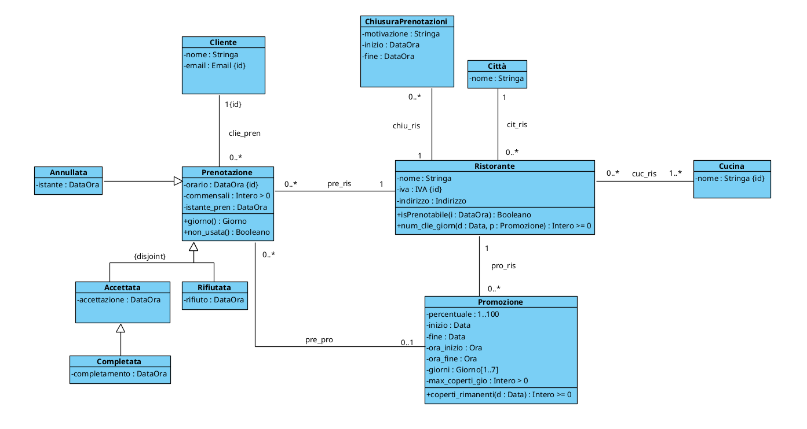
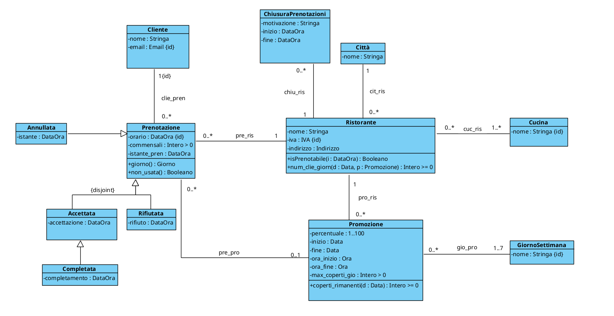
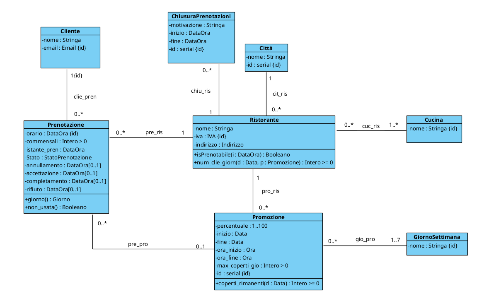

# PROGETTAZIONE RISTOBOOK

- [DIAGRAMMA UML DI PARTENZA](#diagramma-uml-di-partenza)
- [FASE 1 - ELIMINAZIONE ATTRIBUTI MULTIVALORE](#fase-1---eliminazione-attributi-multivalore)
  - [Aggiornamento 1](#aggiornamento-1)
- [FASE 2 - SCELTA E PROGETTAZIONE DEI TIPI DI DATO](#fase-2---scelta-e-progettazione-dei-tipi-di-dato)
- [FASE 3 - RISTRUTTURAZIONE DELLE GENERALIZZAZIONI](#fase-3---ristrutturazione-delle-generalizzazioni)
  - [Generalizzazione Prenotazione](#generalizzazione-prenotazione)
  - [Aggiornamento 2](#aggiornamento-2)
- [FASE 4 - IDENTIFICATORI PER OGNI CLASSE](#fase-4---identificatori-per-ogni-classe)
  - [Aggiornamento 3](#aggiornamento-3)
- [FASE 5 - RISTRUTTURAZIONE VINCOLI ESTERNI ED OPERAZIONI/USE-CASE](#fase-5---ristrutturazione-vincoli-esterni-ed-operazioniuse-case)
- [FASE 6 - TRADUZIONE DEL DIAGRAMMA RISTRUTTURATO IN TABELLE SQL](#fase-6---traduzione-del-diagramma-ristrutturato-in-tabelle-sql)
- [FASE 7 - POLITICHE DI ACCESSO, TRIGGER E FUNZIONALITÀ](#fase-7---politiche-di-accesso-trigger-e-funzionalità)
  - [Politiche di accesso](#politiche-di-accesso)
  - [Trigger](#trigger)
  - [Funzionalità](#funzionalità)

<br><br>

## DIAGRAMMA UML DI PARTENZA


<div style="page-break-after: always;"></div>

## FASE 1 - ELIMINAZIONE ATTRIBUTI MULTIVALORE
All'interno della classe "Promozione" abbiamo un attributo multivalore, procediamo a toglierlo

### Aggiornamento 1


## FASE 2 - SCELTA E PROGETTAZIONE DEI TIPI DI DATO
Andiamo ora a scegliere e creare i nostri tipi di dato SQL.

```sql
CREATE DOMAIN Stringa AS varchar;
CREATE DOMAIN Data AS date;
CREATE DOMAIN DataOra AS timestamp;
CREATE DOMAIN Booleano AS boolean;

CREATE DOMAIN "Intero > 0" AS int
    CHECK (VALUE > 0)

CREATE DOMAIN "Intero >= 0" AS int
    CHECK (VALUE >= 0)

CREATE DOMAIN "1..100" AS int
    CHECK (VALUE > 0 AND VALUE <= 100)

CREATE DOMAIN "IVA" AS varchar(20)

CREATE DOMAIN "Email" AS varchar(30)


CREATE TYPE __Indirizzo__ AS (
    Via: varchar(100),
    Civico: int,
    CAP: varchar(5)
)

CREATE DOMAIN Indirizzo AS __Indirizzo__ 
    CHECK (
        (VALUE).Via IS NOT NULL AND
        (VALUE).Civico IS NOT NULL AND
        (VALUE).CAP ~ '^[0-9]{5}$'
    )
```

<br><br>

## FASE 3 - RISTRUTTURAZIONE DELLE GENERALIZZAZIONI
Scegliamo ora come modificare il diagramma UML per trasformarlo in un diagramma equivalente ma senza generalizzazioni

<br>

### Generalizzazione Prenotazione
Per questa generalizzazione abbiamo optato per fondere tutto all'interno della superclasse.
- PRO: facilità nel capire in che stato si trova una prenotazione all'interno del database
- CONTRO: molte colonne saranno "NULL" all'interno della tabella Prenotazione

Dobbiamo in oltre ricordarci di aggiornare i vincoli per il {disjoint} tra accettata e rifiutata

<div style="page-break-after: always;"></div>

### Aggiornamento 2


<div style="page-break-after: always;"></div>

## FASE 4 - IDENTIFICATORI PER OGNI CLASSE
Ora dobbiamo inserire un identificatore per ogni classe 

<br>

### Aggiornamento 3



<div style="page-break-after: always;"></div>

## FASE 5 - RISTRUTTURAZIONE VINCOLI ESTERNI ED OPERAZIONI/USE-CASE
```
StatoPrenotazione:
{pendente, accettata, rifiutata, annullata, completata}

[V.Prenotazione.segue_stato]
    FORALL p | Prenotazione(p) -> 
        
        ( stato(p, 'accettata') -> 
            (EXISTS ia | accettazione(p, ia)) AND 
            (!EXISTS ir | rifiuto(p, ir)) )
        AND
        
        ( stato(p, 'rifiutata') -> 
            (EXISTS ir | rifiuto(p, ir)) AND 
            (!EXISTS ia | accettazione(p, ia)) )
        AND
        
        ( stato(p, 'annullata') -> 
            EXISTS ian | annullamento(p, ian) )
        AND
        
        ( stato(p, 'completata') -> 
            (EXISTS ia | accettazione(p, ia)) AND 
            (EXISTS ic | completamento(p, ic)) )
        AND

        ( stato(p, 'pendente') -> 
            (!EXISTS ia | accettazione(p, ia)) AND
            (!EXISTS ir | rifiuto(p, ir)) AND
            (!EXISTS ic | completamento(p, ic)) AND
            (!EXISTS ian | annullamento(p, ian)) )
```

<div style="page-break-after: always;"></div>

## FASE 6 - TRADUZIONE DEL DIAGRAMMA RISTRUTTURATO IN TABELLE SQL

```
Cliente(_email_:Email, nome:Stringa)

Città(_id_città_:serial, nome:Stringa)

Ristorante(_iva_:IVA, nome:Stringa, indirizzo:Indirizzo, città:Intero>=0)
    FOREIGN KEY: città REFERENCES Città(id_città)
    V. INCLUSIONE: iva OCCURS in cuc_ris

Cucina(_nome_:Stringa)

cuc_ris(_ristorante_:IVA, _cucina_:Stringa)
    FOREIGN KEY: ristorante REFERENCES Ristorante(IVA)
    FOREIGN KEY: cucina REFERENCES Cucina(nome)

GiornoSettimana(_nome_:Stringa)

Promozione(_id_prom_:serial, perc:1..100, inizio:Data, fine:Data,
           ora_inizio:Ora, ora_fine:Ora, maxcop:Intero>0, ristorante:IVA)
    FOREIGN KEY: ristorante REFERENCES Ristorante(IVA)
    V. INCLUSIONE: id_prom OCCURS in gio_pro
    CHECK ( inizio < fine AND
            ora_inizio < ora_fine )


gio_pro(_promozione_:Intero>=0, _giorno_:Stringa)
    FOREIGN KEY: promozione REFERENCES Promozione(id_prom)
    FOREIGN KEY: giorno REFERENCES GiornoSettimana(nome)

Prenotazione(_orario_:DataOra, _cliente_:Email, commensali:Intero>0
             istante_pren:DataOra, stato:StatoPrenotazione, annullamento*:DataOra,
             accettazione*:DataOra, completamento*:DataOra, rifiuto*:DataOra,
             ristorante:IVA, promozione*:intero>=0)
    FOREIGN KEY: cliente REFERENCES Cliente(email)
    FOREIGN KEY: ristorante REFERENCES Ristorante(IVA)
    FOREIGN KEY: promozione REFERENCES Promozione(id_prom)
    CHECK ( istante_pren <= orario )

ChiusuraPrenotazioni(_id_chius_:serial, motivazione:Stringa, inizio:DataOra
                     fine: DataOra, ristorante:IVA)
    FOREIGN KEY: ristorante REFERENCES Ristorante(IVA)
    CHECK ( inizio < fine )
```

## FASE 7 - POLITICHE DI ACCESSO, TRIGGER E FUNZIONALITÀ

### Politiche di accesso
Evitiamo che si possano modificare gli id artificiali
```sql
Qui vanno inseriti tutti i REVOKE necessari
```

<br>

### Trigger

#### [T.Prenotazione.no_promozione_impossibile]
```sql
    Eventi: AFTER INSERT(new) AND UPDATE(old, new) IN Prenotazione
    FOR EACH ROW

    isError: EXISTS(
        SELECT *
        FROM Promozione pro
        WHERE new.promozione = pro.id_prom AND
              ( new.orario::date NOT BETWEEN pro.inizio AND pro.fine 
                OR
                new.orario::time NOT BETWEEN pro.ora_inizio AND pro.ora_fine 
                OR 
                to_char(new.orario) NOT IN (SELECT giorno
                                            FROM gio_pro gp 
                                            WHERE gp.promozione = pro.id_prom) )
    )

    IF isError:
        Raise Exception('La prenotazione non è valida')
    Return NULL;
```

<div style="page-break-after: always;"></div>

#### [T.Prenotazione.no_promozione_altro_ristorante]
```sql
    EVENTI: AFTER INSERT(new) AND UPDATE(old,new) IN PRENOTAZIONE
    FOR EACH ROW

    isError: EXISTS(
        SELECT *
        FROM Ristorante ris, promozione pro
        WHERE new.promozione = pro.id_prom AND
              new.ristorante = ris.iva AND
              pro.ristorante <> ris.iva 
    )

    IF isError:
        Raise Exception('La prenotazione vuole usare una promozione che non è del ristorante indicato')
    Return NULL;
```

### Funzionalità

#### Cerca Promozioni Città
```sql
CREATE FUNCTION data_valida_prom(p:Promozione, d:Data)
algoritmo

    Q = true <-> EXISTS (
        SELECT *
        FROM gio_pro gp
        WHERE gp.promozione = p.id_prom AND
              gp.giorno = to_char(d) AND
              d BETWEEN p.inizio AND p.fine
    )

    Return Q

CREATE FUNCTION coperti_rimanenti(p:Promozione, d:Data)
algoritmo:

    Q = (SELECT p.maxcop - SUM(pre.commensali)
         FROM prenotazione pre
         WHERE pre.promozione = p.id_prom AND
               pre.orario::data = d AND
               pre.stato IN ('pendente', 'accettata', 'completata') )
    
    Return Q


    
CREATE FUNCTION cerca_prom(x:Città, C:Cucina[1..*], s:1..100, d:Data, num_commens:Intero>0)
algoritmo:

    Q = ( SELECT DISTINCT ris.iva, ris.nome
          FROM promozione pro, ristorante ris, cuc_ris cr
          WHERE pro.ristorante = ris.iva AND
              ris.città = x AND
              cr.cucina = ANY(C) AND
              cr.ristorante = ris.iva AND
              pro.perc >= s AND
              data_valida_prom(pro, d) AND
              num_commens <= coperti_rimanenti(pro, d) )
    
    Return Q
```