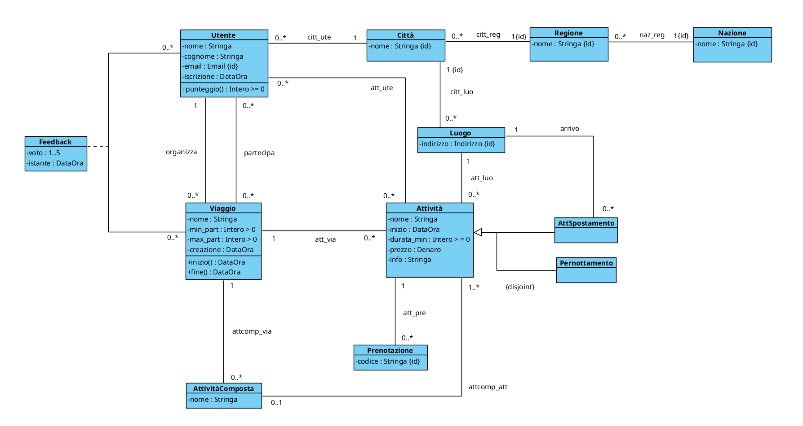
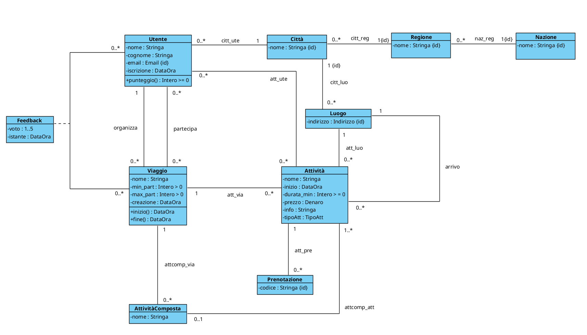
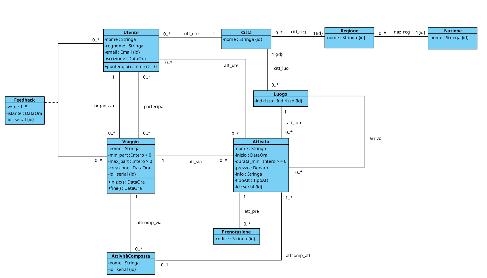

# PROGETTAZIONE TRAVELPLAN

- [DIAGRAMMA UML DI PARTENZA](#diagramma-uml-di-partenza)
- [FASE 1 - ELIMINAZIONE ATTRIBUTI MULTIVALORE](#fase-1---eliminazione-attributi-multivalore)
- [FASE 2 - SCELTA E PROGETTAZIONE DEI TIPI DI DATO](#fase-2---scelta-e-progettazione-dei-tipi-di-dato)
- [FASE 3 - RISTRUTTURAZIONE DELLE GENERALIZZAZIONI](#fase-3---ristrutturazione-delle-generalizzazioni)
  - [Generalizzazione Attività](#generalizzazione-attività)
  - [Aggiornamento 1](#aggiornamento-1)
- [FASE 4 - IDENTIFICATORI PER OGNI CLASSE](#fase-4---identificatori-per-ogni-classe)
  - [Aggiornamento 2](#aggiornamento-2)
- [FASE 5 - RISTRUTTURAZIONE VINCOLI ESTERNI ED OPERAZIONI/USE-CASE](#fase-5---ristrutturazione-vincoli-esterni-ed-operazioniuse-case)
- [FASE 6 - TRADUZIONE DEL DIAGRAMMA RISTRUTTURATO IN TABELLE SQL](#fase-6---traduzione-del-diagramma-ristrutturato-in-tabelle-sql)
- [FASE 7 - POLITICHE DI ACCESSO, TRIGGER E FUNZIONALITÀ](#fase-7---politiche-di-accesso-trigger-e-funzionalità)
  - [Politiche di accesso](#politiche-di-accesso)
  - [Trigger](#trigger)
  - [Funzionalità](#funzionalità)

<br><br>

## DIAGRAMMA UML DI PARTENZA


<div style="page-break-after: always;"></div>

## FASE 1 - ELIMINAZIONE ATTRIBUTI MULTIVALORE
In fase di analisi non sono stati inseriti attributi multivalore, di conseguenza questa
fase non cambia in nessun modo il nostro diagramma.

## FASE 2 - SCELTA E PROGETTAZIONE DEI TIPI DI DATO
Andiamo ora a scegliere e creare i nostri tipi di dato SQL.

```sql
CREATE DOMAIN Stringa AS varchar;
CREATE DOMAIN Data AS date;
CREATE DOMAIN DataOra AS timestamp;

CREATE DOMAIN "Intero > 0" AS int
    CHECK (VALUE > 0)

CREATE DOMAIN "Intero >= 0" AS int
    CHECK (VALUE >= 0)

CREATE TYPE __Denaro__ AS (
    valore: real
    valuta: char(3)
)

CREATE DOMAIN Denaro AS __Denaro__
    CHECK (
        (VALUE).valore IS NOT NULL AND
        (VALUE).valore >= 0
        (VALUE).valuta IS NOT NULL AND
    )

CREATE TYPE __Indirizzo__ AS (
    Via: varchar(100),
    Civico: int,
    CAP: varchar(5)
)

CREATE DOMAIN Indirizzo AS __Indirizzo__ 
    CHECK (
        (VALUE).Via IS NOT NULL AND
        (VALUE).Civico IS NOT NULL AND
        (VALUE).CAP ~ '^[0-9]{5}$'
    )
```

<div style="page-break-after: always;"></div>

## FASE 3 - RISTRUTTURAZIONE DELLE GENERALIZZAZIONI
Scegliamo ora come modificare il diagramma UML per trasformarlo in un diagramma equivalente ma senza generalizzazioni

<br>

### Generalizzazione Attività
Per questa generalizzazione abbiamo optato per il metodo della fusione.
- PRO: query molto più veloci
- CONTRO: alcune tuple avranno "NULL" nella colonna "luogo_arrivo"
Dobbiamo ricordarci di inserire il vincolo "esiste un link 'arrivo' solo se tipoAtt è 'spostamento' "
  
<div style="page-break-after: always;"></div>

### Aggiornamento 1



<br><br>

## FASE 4 - IDENTIFICATORI PER OGNI CLASSE
Ora dobbiamo inserire un identificatore per ogni classe 

<br>

### Aggiornamento 2



<div style="page-break-after: always;"></div>

## FASE 5 - RISTRUTTURAZIONE VINCOLI ESTERNI ED OPERAZIONI/USE-CASE

```
TipoAtt: ('semplice', 'spostamento', 'pernottamento')

[V.Attività.arrivo_solo_se_spostamento]
    FORALL a |
        Attività(a) AND tipoAtt(a, spostamento) <-> EXISTS luo | arrivo(a, luo)
```

<div style="page-break-after: always;"></div>

## FASE 6 - TRADUZIONE DEL DIAGRAMMA RISTRUTTURATO IN TABELLE SQL
```

Nazione(_nome_:Stringa)

Regione(_nome_:Stringa, _nazione_:Stringa)
    FOREIGN KEY: nazione REFERENCES Nazione(nome)

Città(_id_citt_:serial, nome:Stringa, regione:Stringa, nazione:Stringa)
    FOREIGN KEY: (regione, nazione) REFERENCES Regione(nome, nazione)
    // Ho aggiunto l'id_citt solo per non portarmi in ogni tabella tutte le colonne

Utente(_email_:Email, nome:Stringa, cognome:Stringa, iscrizione:DataOra, città:Intero>=0)
    FOREIGN KEY: città REFERENCES Città(id_citt)

Viaggio(_id_viaggio_:serial, utente:Email, nome:Stringa,
        min_part:Intero>0, max_part:Intero>0, creazione:DataOra)
    FOREIGN KEY: utente REFERENCES Utente(email)

Luogo(_indirizzo_:Indirizzo, _città_:Intero>=0)
    FOREIGN KEY: città REFERENCES Città(id_citt)

Attività(_id_att_:serial, nome:Stringa, inizio:DataOra, durata_min:Intero>=0,
            prezzo:Denaro, info:Stringa, tipoAtt:TipoAtt, luogo:Indirizzo, 
            città:Intero>=0, viaggio:Intero>=0, arrivo*:Indirizzo, città_arr*:Intero>=0)
    FOREIGN KEY: (luogo, città) REFERENCES Luogo(indirizzo, città)
    FOREIGN KEY: viaggio REFERENCES Viaggio(id_viaggio)
    FOREIGN KEY: (arrivo, città_arr) REFERENCES Luogo(indirizzo, id_citt)
    CHECK ( tipoAtt = 'Spostamento' <-> arrivo IS NOT NULL AND città_arr IS NOT NULL )

Prenotazione(_codice_:Stringa, attività:Intero>=0)
    FOREIGN KEY: attività REFERENCES Attività(id_att)

AttivitàComposta(_id_attc_:serial, nome:Stringa, viaggio:Intero>=0)
    FOREIGN KEY: viaggio REFERENCES Viaggio(id_viaggio)
    V. INCLUSIONE: id_attc OCCURS in attcomp_att

attcomp_att(_attc_:Intero>=0, _att_:Intero>=0)
    FOREIGN KEY: att REFERENCES Attività(id_att)
    FOREIGN KEY: attc REFERENCES AttivitàComposta(id_attc)

feedback(_utente_:Email, _viaggio_:Intero>=0, voto:1..5, istante:DataOra)
    FOREIGN KEY: (utente, viaggio) REFERENCES partecipa(utente, viaggio) 

partecipa(_utente_:Email, _viaggio_:Intero>=0)
    FOREIGN KEY: utente REFERENCES Utente(email)
    FOREIGN KEY: viaggio REFERENCES Viaggio(id_viaggio)

att_ute(_attività_:Intero>=0, _utente_:Email)
    FOREIGN KEY: attività REFERENCES Attività(id_att)
    FOREIGN KEY: utente REFERENCES Utente(email)
```

<br><br>

## FASE 7 - POLITICHE DI ACCESSO, TRIGGER E FUNZIONALITÀ

### Politiche di accesso
Evitiamo che si possano modificare gli id artificiali
```sql
Qui vanno inseriti tutti i REVOKE necessari
```

<br>

### Trigger

#### [T.Utente.max_un_pernottamento_al_giorno]
```sql
Eventi: AFTER INSERT(new) AND UPDATE(old,new) IN att_ute
FOR EACH ROW

isError = EXISTS (
    SELECT *
    FROM att_ute au, attività anew, attività aold
    WHERE anew.id_att = new.attività AND
          anew.tipoAtt = 'Pernottamento' AND
          au.utente = new.utente AND
          au.attività <> new.attività AND
          au.attività = aold.id_att AND
          aold.tipoAtt = 'Pernottamento' AND
          anew.inizio::date = aold.inizio::date
)

IF isError:
    Raise Exception('...')
Return NULL;

-- Questo trigger non tiene conto dei pernottamenti "impliciti" (ovvero quelli in cui l'attività non ha nessun utente specificato)
```

### Funzionalità

#### Punteggio
```sql
CREATE FUNCTION punteggio_utente(u:Utente)
algoritmo:

    media = (
            SELECT AVG(voto)
            FROM feedback f, viaggio v
            WHERE f.viaggio = v.id_viaggio AND
                  v.utente = u.email
        )

    IF media IS NOT NULL:
        IF media <= 3:
            Return 0
        ELSE:
            result = FLOOR(0.1 * (
                SELECT COUNT(*)
                FROM feedback f, viaggio v
                WHERE f.viaggio = v.id_viaggio AND
                      v.utente = u.email AND f.voto >= 4
            ) )
            Return result
    ELSE:
        Return Null
```