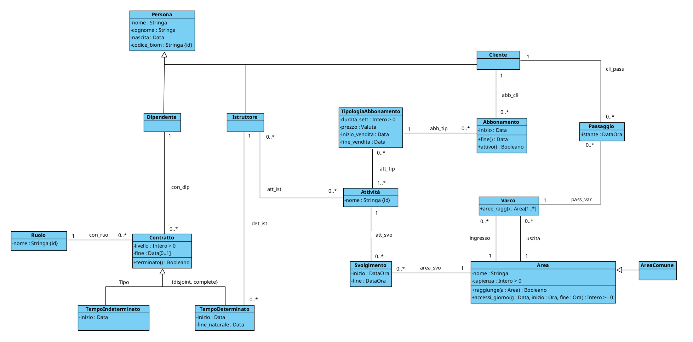
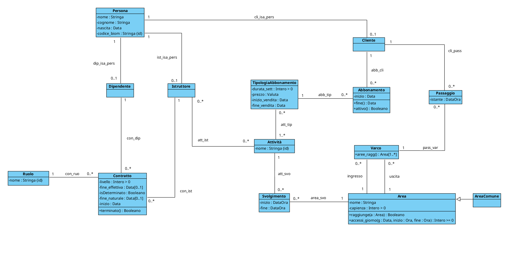
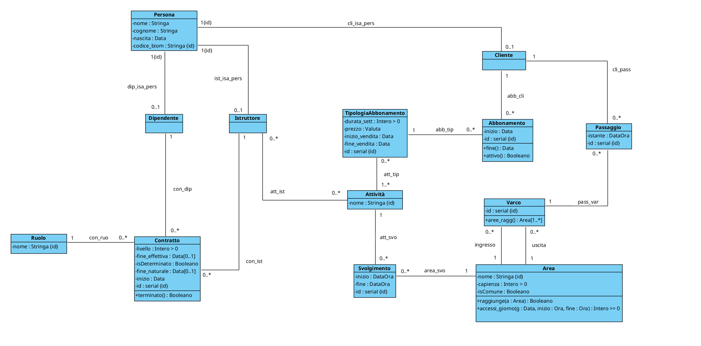

# PROGETTAZIONE XFIT

- [DIAGRAMMA UML DI PARTENZA](#diagramma-uml-di-partenza)
- [FASE 1 - ELIMINAZIONE ATTRIBUTI MULTIVALORE](#fase-1---eliminazione-attributi-multivalore)
- [FASE 2 - SCELTA E PROGETTAZIONE DEI TIPI DI DATO](#fase-2---scelta-e-progettazione-dei-tipi-di-dato)
- [FASE 3 - RISTRUTTURAZIONE DELLE GENERALIZZAZIONI](#fase-3---ristrutturazione-delle-generalizzazioni)
  - [Generalizzazione Persona](#generalizzazione-persona)
  - [Generalizzazione Contratto](#generalizzazione-contratto)
  - [Aggiornamento 1](#aggiornamento-1)
- [FASE 4 - IDENTIFICATORI PER OGNI CLASSE](#fase-4---identificatori-per-ogni-classe)
  - [Aggiornamento 2](#aggiornamento-2)
- [FASE 5 - RISTRUTTURAZIONE VINCOLI ESTERNI ED OPERAZIONI/USE-CASE](#fase-5---ristrutturazione-vincoli-esterni-ed-operazioniuse-case)
- [FASE 6 - TRADUZIONE DEL DIAGRAMMA RISTRUTTURATO IN TABELLE SQL](#fase-6---traduzione-del-diagramma-ristrutturato-in-tabelle-sql)
- [FASE 7 - POLITICHE DI ACCESSO, TRIGGER E FUNZIONALITÀ](#fase-7---politiche-di-accesso-trigger-e-funzionalità)
  - [Politiche di accesso](#politiche-di-accesso)
  - [Trigger](#trigger)
  - [Funzionalità](#funzionalità)


<br><br>

## DIAGRAMMA UML DI PARTENZA


<div style="page-break-after: always;"></div>

## FASE 1 - ELIMINAZIONE ATTRIBUTI MULTIVALORE
In fase di analisi non sono stati inseriti attributi multivalore, di conseguenza questa
fase non cambia in nessun modo il nostro diagramma.

## FASE 2 - SCELTA E PROGETTAZIONE DEI TIPI DI DATO
Andiamo ora a scegliere e creare i nostri tipi di dato SQL.

```sql
CREATE DOMAIN Stringa AS varchar;
CREATE DOMAIN Data AS date;
CREATE DOMAIN DataOra AS timestamp;
CREATE DOMAIN Booleano AS boolean;

CREATE DOMAIN "Intero > 0" AS int
    CHECK (VALUE > 0)

CREATE DOMAIN "Intero >= 0" AS int
    CHECK (VALUE >= 0)

CREATE TYPE __Denaro__ AS (
    valore: real
    valuta: char(3)
)

CREATE DOMAIN Denaro AS __Denaro__
    CHECK (
        (VALUE).valore IS NOT NULL AND
        (VALUE).valore >= 0
        (VALUE).valuta IS NOT NULL AND
    )
```

<div style="page-break-after: always;"></div>

## FASE 3 - RISTRUTTURAZIONE DELLE GENERALIZZAZIONI
Scegliamo ora come modificare il diagramma UML per trasformarlo in un diagramma equivalente ma senza generalizzazioni

<br>

### Generalizzazione Persona
Per questa generalizzazione abbiamo optato per la sostituzione tramite associazioni
<br>
- PRO: Dato che ogni classe (Cliente, istruttore, dipendente) ha le proprie associazioni, vogliamo "distruggere" il meno possibile il diagramma, così dovremo aggiungere solo il vincolo {complete, disjoint} 
- CONTRO: la navigazione tra i diversi "tipi" avrà un suo costo

### Generalizzazione Contratto
Per questa generalizzazione abbiamo optato per la fusione 
<br>
- PRO: Facilità nel navigare tra contratti determinati e non
- CONTRO: alcune tuple nella tabella contratto avranno colonne "NULL" che occupano spazio inutilmente, dovremo modificare il vincolo tra istruttore e contratto ed aggiungere il vincolo sugli attributi

<div style="page-break-after: always;"></div>

### Aggiornamento 1



<br><br>

## FASE 4 - IDENTIFICATORI PER OGNI CLASSE
Ora dobbiamo inserire un identificatore per ogni classe 

<br>

### Aggiornamento 2



<div style="page-break-after: always;"></div>

## FASE 5 - RISTRUTTURAZIONE VINCOLI ESTERNI ED OPERAZIONI/USE-CASE

```
[V.Persona.complete_disjoint]
    FORALL p | Persona(p) -> ( Cliente(p) AND !(Dipendente(p) OR Istruttore(p)) OR
                               Dipendente(p) AND !(Cliente(p) OR Istruttore(p)) OR
                               Istruttore(p) AND !(Cliente(p) OR Dipendente(p)) )

[V.Contratto.no_fine_naturale_se_indeterminato]
    !EXISTS fnat |
        isDeterminato(this, false) AND
        fine_naturale(this, fnat)

[V.Contratto.fine_naturale_se_determinato]
    isDeterminato(this, true) -> EXISTS fnat | fine_naturale(this, fnat)

[V.Istruttore.solo_contratti_determinati]
    FORALL c |
        con_ist(c, this) -> isDeterminato(c, true)

[V.Area.no_svolgimenti_se_comune]
    !EXISTS svo |
        isComune(this, true) AND
        area_svo(this, svo)
```

<div style="page-break-after: always;"></div>

## FASE 6 - TRADUZIONE DEL DIAGRAMMA RISTRUTTURATO IN TABELLE SQL

```
Persona(_cod_biom_:Stringa, nome:Stringa, cognome:Stringa, nascita:Data)

Dipendente(persona:Stringa)
    FOREIGN KEY: persona REFERENCES Persona(cod_biom)

Istruttore(persona:Stringa)
    FOREIGN KEY: persona REFERENCES Persona(cod_biom)

Cliente(persona:Stringa)
    FOREIGN KEY: persona REFERENCES Persona(cod_biom)

Ruolo(_nome_:Stringa)

Contratto(_id_contratto_:serial, livello:Intero>0, fine_effettiva*:Data,
           isDeterminato:Booleano, fine_naturale*:Data, inizio:Data, ruolo:Stringa,
           dipendente:Stringa, istruttore:Stringa)
    FOREIGN KEY: dipendente REFERENCES Dipendente(persona) 
    FOREIGN KEY: istruttore REFERENCES Istruttore(persona)
    FOREIGN KEY: ruolo REFERENCES Ruolo(nome)
    CHECK ( (dipendente IS NOT NULL AND istruttore IS NULL) OR (dipendente IS NULL AND istruttore IS NOT NULL) )
    CHECK ( inizio < fine_naturale )

Attività(_nome_:Stringa)

att_ist(_istruttore_:Stringa, _attività_:Stringa)
    FOREIGN KEY: istruttore REFERENCES Istruttore(persona)
    FOREIGN KEY: attività REFERENCES Attività(nome)

Area(_nome_:Stringa, capienza:Intero>0, isComune:Booleano)

Svolgimento(_id_svol_:serial, inizio:DataOra, fine:DataOra, attività:Stringa, area:Stringa)
    FOREIGN KEY: attività REFERENCES Attività(nome)
    FOREIGN KEY: area REFERENCES Area(nome)
    CHECK ( inizio < fine )

TipologiaAbbonamento(_id_tipol_:serial, durata_sett:Intero>0, prezzo:Valuta,
                     inizio_vendita:Data, fine_vendita:Data)
    V. INCLUSIONE: id_tipol OCCORRE in att_tip
    CHECK ( inizio_vendita < fine_vendita )
```

<div style="page-break-after: always;"></div>

```
att_tip(_attività_:Stringa, _tipologia_:Intero>=0)
    FOREIGN KEY: tipologia REFERENCES TipologiaAbbonamento(id_tipol)
    FOREIGN KEY: attività REFERENCES Attività(nome)

Abbonamento(_id_abbon_:serial, inizio:Data, tipologia:Intero>=0, cliente:Stringa)
    FOREIGN KEY: cliente REFERENCES Cliente(cod_biom)
    FOREIGN KEY: tipologia REFERENCES TipologiaAbbonamento(id_tipol)

Varco(_id_varco_:serial, ingresso:Stringa, uscita:Stringa)
    FOREIGN KEY: ingresso REFERENCES Area(nome)
    FOREIGN KEY: uscita REFERENCES Area(nome)
    CHECK ( ingresso <> uscita)

Passaggio(_id_:serial, istante:DataOra, cliente:Stringa, varco:Intero>=0)
    FOREIGN KEY: varco REFERENCES Varco(id_varco)
    FOREIGN KEY: cliente REFERENCES Cliente(cod_biom)
```

<br><br>

## FASE 7 - POLITICHE DI ACCESSO, TRIGGER E FUNZIONALITÀ

### Politiche di accesso
Evitiamo che si possano modificare gli id artificiali
```sql
Qui vanno inseriti tutti i REVOKE necessari
```

<br>

### Trigger
```sql
[T.Svolgimento.no_due_contemporanei]
    Eventi: AFTER INSERT(new) AND UPDATE(old, new) IN Svolgimento
    FOR EACH ROW 

    isError: EXISTS(
        SELECT *
        FROM Svolgimento s
        WHERE s.area = new.area AND
              s.id <> new.id AND
              (s.inizio, s.fine) OVERLAPS (new.inizio, new.fine)
    )

    IF isError:
        Raise Exception('non puoi aggiungere questo svolgimento')
    Return NULL;

[T.Abbonamento.no_inizio_prima_inizio_vendita_tipologia]
    Eventi: AFTER INSERT(new) AND UPDATE(old, new) IN Abbonamento
    FOR EACH ROW 

    isError: EXISTS(
        SELECT *
        FROM tipologia tip
        WHERE new.tipologia = tip.id_tipol AND
              new.inizio < tip.inizio_vendita
    )

    IF isError:
        Raise Exception('non è possibile che un abbonamento inizi prima che la sua stessa tipologia sia stata messa in vendita')
    Return NULL;

[T.Svolgimento.no_area_comune]
    Eventi: AFTER INSERT(new) AND UPDATE(old, new) IN Svolgimento
    FOR EACH ROW 

    isError: EXISTS(
        SELECT *
        FROM Area a
        WHERE new.area = a.nome AND
              a.isComune = true
    )

    IF isError:
        Raise Exception('non puoi aggiungere questo svolgimento')
    Return NULL;
```

<div style="page-break-after: always;"></div>

### Funzionalità
```sql
CREATE FUNCTION accesso(c:Stringa, v:Intero>=0, dir:{ingresso, uscita}): Intero>=0
    IF dir = ingresso:

        Q = SELECT *
            FROM abbonamento abb
            WHERE abb.cliente = c AND
                  NOW() BETWEEN abb.inizio AND fine(abb) AND
                  // Serve controllare che o la prossima area sia comune oppure che il    cliente si stia dirigendo verso una area dove si sta svolgendo una attività compresa tra i suoi abbonamenti
        
        IF Q = vuoto:
            Raise Exception('non puoi attraversare il varco')
        
        INSERT INTO Passaggio(...) VALUES (NOW(), c, v)
```