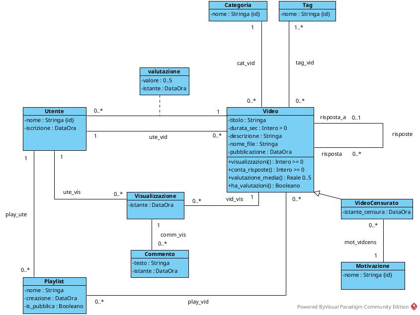

---
title: "TUTUBI"
mainfont: "Fira Mono" 
header-includes:
  - \usepackage{float}
  - \floatplacement{figure}{H}
  - \usepackage{titling}
  - \pretitle{\begin{center}\LARGE\bfseries}
  - \posttitle{\end{center}\vspace{-2em}}
  - \preauthor{}
  - \postauthor{}
  - \predate{}
  - \postdate{}
---	

	
## DIAGRAMMA DELLE CLASSI

	
## SPECIFICA DEI TIPI DI DATO
	
