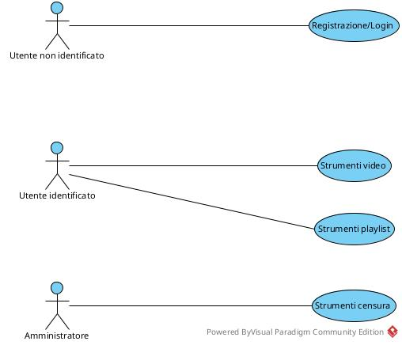

## DIAGRAMMA DEGLI USE-CASE


## SPECIFICA DEGLI USE-CASE

### Use-Case Registrazione/login

```text
	registrazione(nome:Stringa): Utente
		pre:
			non deve esistere alcun u:Utente tale che:
				- u.nome = nome
		post:
			viene creato e restituito un oggetto result:Utente tale che:
				- result.nome = nome
				- result.iscrizione = adesso
```

### Use-Case Strumenti video

```text
	pubblica_video(
		tit:Stringa,
		durata:Intero > 0,
		desc:Stringa,
		nome_f:Stringa,
		cat:Categoria,
		instag:Tag[1..*]
		vid:Video [0..1]
	): Video
		pre:
			sia u:Utente l'istanza dell'attore che ha invocato lo use-case
				deve essere u.iscrizione <= adesso

			se vid è valorizzato:
				vid non deve essere di classe più specifica VideoCensurato
				inoltre, non deve essere:
					- (u, vid):ute_vid
		post:
			viene creato e restituito un oggetto result:Video tale che:
				- result.titolo = tit
				- result.durata_sec = durata
				- result.descrizione = desc
				- result.nome_file = nome_f
				- result.pubblicazione = adesso

			se vid è valorizzato:
				viene creato il seguente link
					- (result:risposta, vid:risposta_a):Risposte

			vengono creati i seguenti link
				- (cat, result):cat_vid
				per ogni oggetto tag:Tag in instag:
					- (tag, result):tag_vid
				- (u, result):ute_vid

	visualizza_video(v:Video): Visualizzazione
		pre:
			v non deve essere di classe più specifica VideoCensurato
		post:
			viene creato e restituito un oggetto result:Visualizzazione tale che:
				- result.istante = adesso

			sia u:Utente l'istanza dell'attore che ha invocato lo use-case
			vengono creati i seguenti link:
				- (u, result):ute_vis
				- (v, result):vid_vis

	rilascia_valutazione(v:Video, val:Intero 0..5): 
		pre:
			v non deve essere di classe più specifica VideoCensurato
			
			sia u:Utente l'istanza dell'attore che ha invocato lo use-case
			non deve esistere il seguente link:
				- (u, v):ute_vid

			sia VIS l'insieme degli oggetti vis:Visualizzazione tali che:
				- (u, vis):ute_vis

			sia VISVID il sottoinsieme di VIS tale che:
				- (v, vis):vid_vis

			il numero degli elementi di VISVID deve essere maggiore di 0
		post:
			viene creato un oggetto result:(u,v):valutazione tale che:
				- result.valore = val
				- result.istante = adesso

	rilascia_commento(tes:Stringa, vis:Visualizzazione): Commento
		pre:
			sia u:Utente l'istanza dell'attore che ha invocato lo use-case, deve essere:
				(u, vis):ute_vis

			sia v:Video tale che:
				- (v, vis):vid_vis
				allora v non deve essere di classe più specifica VideoCensurato
		post:
			viene creato e restituito un oggetto result:Commento tale che:
				- result.testo = tes
				- result.istante = adesso

			vengono creati i seguenti link:
				- (result, vis):comm_vis
				
	mostra_cronologia(): Video[0..*]
		pre:
			nessuna
		post:
			sia u:Utente l'istanza dell'attore che ha invocato lo use-case

			sia VID l'insieme degli oggetti vid:Video tali che:
				- vid non è di classe più specifica VideoCensurato
				- (u, vis:Visualizzazione):ute_vis
				- (vid, vis):vid_vis

			VID sarà ordinato in ordine decrescente in base al vis.istante
				dell'ultimo link (vid, vis:Visualizzazione):vid_vis 
				riferito all'utente che ha invocato lo use-case per ogni elemento
				in VID

			se il numero di elementi in VID è 0:
				- result = nulla
			altrimenti:
				- result = VID

	cerca_video(
		cat:Categoria,
		instag:Tag[0..*]
		v:Intero 0..5 [0..1]
	): Video[0..*]
		pre:
			nessuna
		post:
			se instag e v non sono valorizzati:
				Sia VIDCAT l'insieme degli oggetti vid:Video tali che:
					- vid non è di classe più specifica VideoCensurato
					- (cat, vid):cat_vid

				sia VIDCATRISP il sottoinsieme di VIDCAT tale che:
					- vid.conta_risposte() è massimo

				result = VIDCATRISP

			altrimenti:
				Sia VIDCATTAG l'insieme degli oggetti vid:Video tale che:
					- vid non è di classe più specifica VideoCensurato
					- (cat, vid):cat_vid
					- (tag, vid):tag_vid per almeno un tag:Tag all'interno di instag

				Sia VIDVAL il sottoinsieme di VIDCATTAG tale che:
					- vid.valutazione_media() >= v
					oppure
					- vid.ha_valutazioni() = false

				result = VIDVAL
```

### Use-Case Strumenti playlist
```text
	crea_playlist(n:Stringa, pub:Booleano, insvid:Video[0..*]): Playlist
		pre:
			per ogni oggetto vid:Video all'interno dell'insieme insvid deve essere:
				- vid non è di classe più specifica VideoCensurato
		post:
			sia u:Utente l'istanza dell'attore che ha invocato lo use-case

			viene creato e restituito un oggetto result:Playlist tale che:
				- result.nome = n
				- result.creazione = adesso
				- result.is_pubblica = pub

			vengono creati i seguenti link:
				- (result, u):play_ute
				- per ogni vid:Video in insvid:
					(result, vid):play_vid

	visualizza_playlist(u:Utente): Playlist[0..*]
		pre: 
			u non deve essere uguale all'istanza dell'attore che ha invocato 
				lo use-case
		post:
			sia P l'insieme degli oggetti p:Playlist tali che:
				- (p, u):play_utente
				- p.is_pubblica = true

			result = P

### Use-Case Strumenti censura
	censura_video(v:Video, mot:Motivazione): VideoCensurato
		pre:
			nessuna
		post:
			l'oggetto v viene reso di classe più specifica VideoCensurato con:
				v.istante_censura = adesso
			e viene restituito

			viene creato il seguente link:
				- (mot, v):mot_vidcens

			vengono eliminati tutti i link del tipo:
				- (p:Playlist, v):play_vid
					per ogni p esistente
				
```
